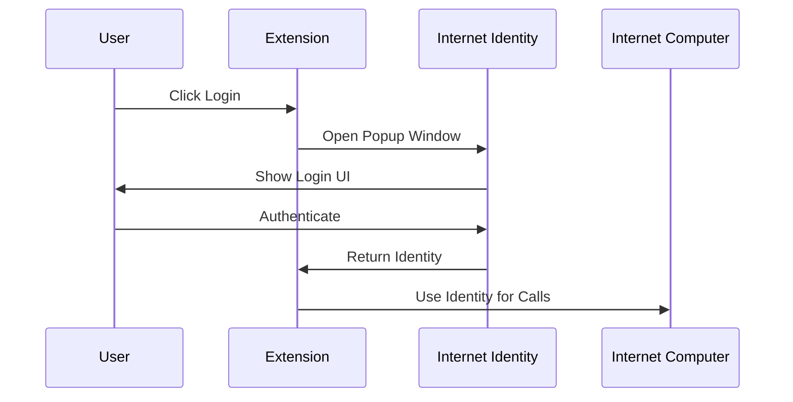

# RhinoSpider Authentication Architecture

## Overview

RhinoSpider uses Internet Identity (II) as its primary authentication system. II is ICP's native authentication system that provides secure, anonymous authentication across dapps.

## Why Internet Identity?

1. **Security**
   - Cryptographically secure authentication
   - No password storage required
   - Device-based authentication
   - Protection against phishing

2. **User Privacy**
   - Anonymous authentication
   - Different identities for different dapps
   - No personal data collection

3. **Cross-platform Support**
   - Works across browsers and devices
   - Consistent user experience

## Data Flow Architecture

1. **Data Flow Pattern**
   - Extension -> Consumer Canister -> Admin/Storage Canisters

2. **Key Principles**
   - Extension NEVER directly accesses admin or storage canisters
   - All data flows through consumer canister
   - Extension operates in read-only mode for admin data
   - Extension submits scraped content through consumer canister only
   - All requests must be properly authenticated with Internet Identity

3. **Core Operations**
   - Topic Fetching: Extension -> Consumer -> Admin
   - Content Submission: Extension -> Consumer -> Storage
   - AI Processing: Extension -> Consumer -> Admin -> AI
   - Authentication: Extension -> II -> Consumer

4. **Authentication Flow**
   - Internet Identity provides delegation chain
   - Extension stores delegation chain with proper encoding
   - All requests include properly formatted delegation chain
   - Consumer canister validates delegation before forwarding

5. **Security Benefits**
   - Reduced attack surface
   - Controlled access to backend systems
   - Proper authentication flow
   - Data validation at consumer level
   - Delegation chain integrity maintained

## Implementation

### 1. Dependencies
```json
{
  "dependencies": {
    "@dfinity/auth-client": "^0.15.7",
    "@dfinity/identity": "^0.15.7",
    "@dfinity/principal": "^0.15.7",
    "@dfinity/agent": "^0.15.7"
  }
}
```

### 2. Authentication Flow



### 3. Extension Implementation

#### Popup Component
```javascript
// Initialize auth client and handle login
const handleLogin = async () => {
  const authClient = await AuthClient.create({
    idleOptions: {
      idleTimeout: 30 * 60 * 1000, // 30 minutes
      disableDefaultIdleCallback: true
    }
  });

  await authClient.login({
    identityProvider: II_URL,
    maxTimeToLive: BigInt(30 * 60 * 1000 * 1000 * 1000), // 30 minutes
    onSuccess: async () => {
      const identity = authClient.getIdentity();
      // Store delegation chain and update UI
    }
  });
};
```

#### Background Service
```javascript
// Reconstruct identity from stored delegation chain
const identity = new DelegationIdentity(publicKey, delegations);
const agent = new HttpAgent({ identity });

// Use agent for canister calls
const actor = Actor.createActor(idlFactory, {
  agent,
  canisterId: ADMIN_CANISTER_ID
});
```

### 4. Security Features

1. **Session Management**
   - 30-minute idle timeout
   - Secure session storage in extension
   - Automatic cleanup of expired sessions

2. **Identity Management**
   - Delegation chain storage and reconstruction
   - Proper principal verification
   - No anonymous access in production

3. **State Management**
   - Consistent state between popup and background
   - Secure storage of delegation chains
   - Proper cleanup on logout

### 5. Production Considerations

1. **Security**
   - Never allow anonymous principals
   - Always verify delegation chain expiration
   - Properly handle session timeouts

2. **User Experience**
   - Clean popup window management
   - Clear error messages
   - Smooth login/logout flow

3. **Maintenance**
   - Regular security audits
   - Version updates for II dependencies
   - Monitoring of auth failures

## Troubleshooting

1. **Common Issues**
   - Identity reconstruction failures
   - Delegation chain expiration
   - Window management issues

2. **Solutions**
   - Clear invalid auth states
   - Proper error handling
   - Regular state validation

## Future Improvements

1. **Features**
   - Multiple identity support
   - Enhanced session management
   - Better error recovery

2. **Security**
   - Additional verification layers
   - Enhanced monitoring
   - Automated security checks

## Resources

1. Official Documentation:
   - [Internet Identity Specification](https://internetcomputer.org/docs/current/references/ii-spec/)
   - [Authentication Guide](https://internetcomputer.org/docs/current/developer-docs/integrations/internet-identity/)
   - [Security Best Practices](https://internetcomputer.org/docs/current/developer-docs/security/)
