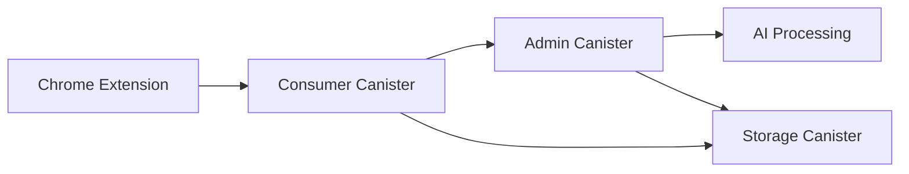
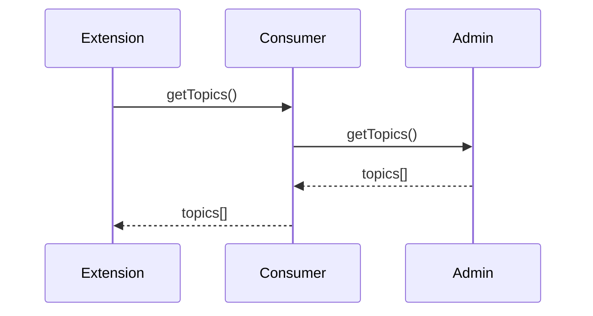
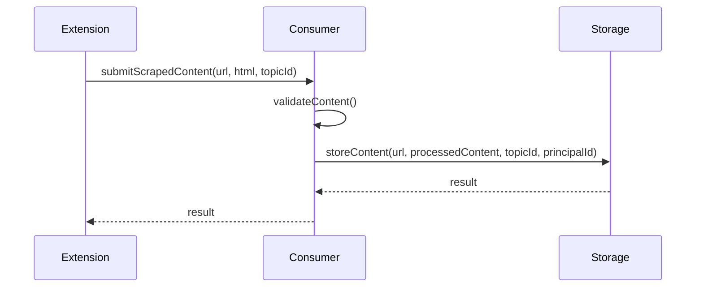
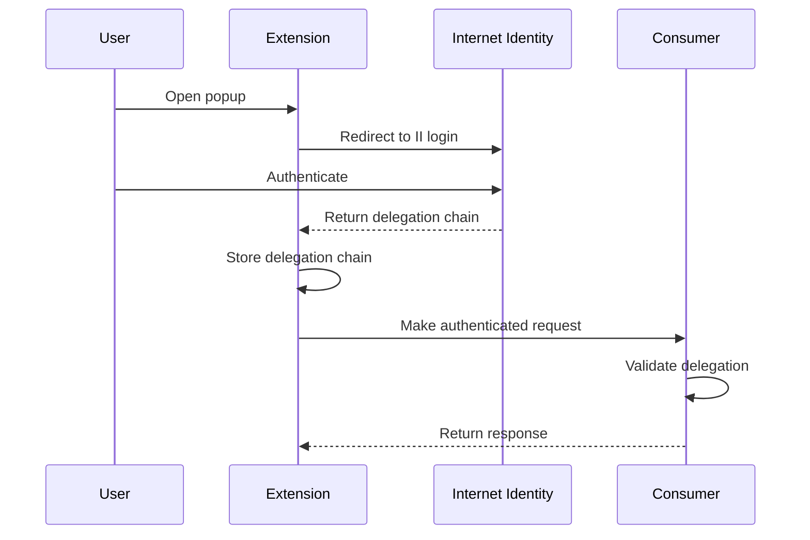
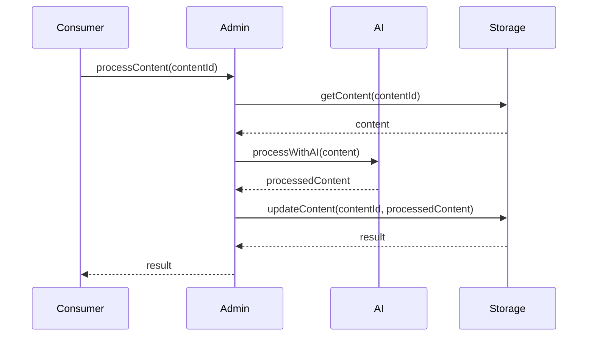
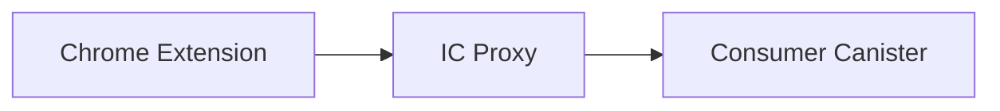

# RhinoSpider Data Flow Architecture

## Overview

RhinoSpider follows a strict data flow pattern to ensure security, proper separation of concerns, and controlled access to backend systems. This document outlines the complete data flow architecture, from the extension to the storage canisters.

## Core Architecture



## Key Principles

1. **Strict Access Control**
   - Extension NEVER directly accesses admin or storage canisters
   - All data flows through consumer canister
   - Extension operates in read-only mode for admin data
   - Extension submits scraped content through consumer canister only

2. **Authentication Requirements**
   - All requests must be properly authenticated with Internet Identity
   - Delegation chain must be maintained and validated
   - Consumer canister validates all authentication before forwarding

3. **Data Validation**
   - Consumer canister validates all data before forwarding
   - Each canister implements its own validation
   - Errors are handled at each level

## Core Operations

### 1. Topic Fetching Flow



**Implementation Details:**

```javascript
// Extension
async function fetchTopics() {
  try {
    const response = await fetch(`${PROXY_URL}/api/topics`, {
      headers: {
        'Authorization': `Bearer ${getAuthToken()}`
      }
    });
    
    if (response.ok) {
      return await response.json();
    }
    throw new Error(`Failed to fetch topics: ${response.statusText}`);
  } catch (error) {
    console.error("Error fetching topics:", error);
    return [];
  }
}

// Consumer Canister
public shared(msg) func getTopics() : async Result<[Topic], Text> {
  // Validate caller
  if (not isAuthorized(msg.caller)) {
    return #err("Not authorized");
  }
  
  // Forward to admin canister
  let adminResponse = await AdminCanister.getTopics();
  return adminResponse;
}

// Admin Canister
public shared(msg) func getTopics() : async Result<[Topic], Text> {
  // Validate caller
  if (not isConsumerCanister(msg.caller)) {
    return #err("Not authorized");
  }
  
  // Return topics
  return #ok(topics);
}
```

### 2. Content Submission Flow



**Implementation Details:**

```javascript
// Extension
async function submitScrapedData(url, html, topicId) {
  try {
    const response = await fetch(`${PROXY_URL}/api/submit-scraped-content`, {
      method: 'POST',
      headers: {
        'Content-Type': 'application/json',
        'Authorization': `Bearer ${getAuthToken()}`
      },
      body: JSON.stringify({
        url,
        html,
        topicId,
        principalId: getPrincipalId()
      })
    });
    
    if (response.ok) {
      return await response.json();
    }
    throw new Error(`Submission failed: ${response.statusText}`);
  } catch (error) {
    console.error("Error submitting scraped data:", error);
    return { success: false, error: error.message };
  }
}

// Consumer Canister
public shared(msg) func submitScrapedContent(url: Text, content: Text, topicId: Text, principalId: Text) : async Result<Text, Text> {
  // Validate caller
  if (not isAuthorized(msg.caller)) {
    return #err("Not authorized");
  }
  
  // Validate content
  if (not isValidContent(content)) {
    return #err("Invalid content");
  }
  
  // Process content
  let processedContent = processContent(content);
  
  // Forward to storage canister
  let storageResponse = await StorageCanister.storeContent(url, processedContent, topicId, principalId);
  return storageResponse;
}

// Storage Canister
public shared(msg) func storeContent(url: Text, content: Text, topicId: Text, principalId: Text) : async Result<Text, Text> {
  // Validate caller
  if (not isConsumerCanister(msg.caller)) {
    return #err("Not authorized");
  }
  
  // Store content
  let contentId = generateContentId();
  contentStore.put(contentId, {
    url;
    content;
    topicId;
    principalId;
    timestamp = Time.now();
  });
  
  return #ok(contentId);
}
```

### 3. Authentication Flow



**Implementation Details:**

```javascript
// Extension Authentication
async function authenticate() {
  // Redirect to Internet Identity
  const authClient = await AuthClient.create();
  await authClient.login({
    identityProvider: `https://identity.ic0.app`,
    onSuccess: async () => {
      // Get delegation chain
      const identity = authClient.getIdentity();
      const delegationChain = identity.getDelegation();
      
      // Store delegation chain
      await storeIdentity(delegationChain);
      
      // Update UI
      updateAuthStatus(true);
    }
  });
}

// Extension Request with Authentication
async function makeAuthenticatedRequest(url, method = 'GET', body = null) {
  // Get stored delegation chain
  const delegationChain = await getStoredIdentity();
  if (!delegationChain) {
    throw new Error("Not authenticated");
  }
  
  // Create headers with authentication
  const headers = {
    'Authorization': `Bearer ${encodeIdentity(delegationChain)}`
  };
  
  if (body) {
    headers['Content-Type'] = 'application/json';
  }
  
  // Make request
  const response = await fetch(url, {
    method,
    headers,
    body: body ? JSON.stringify(body) : null
  });
  
  return response;
}

// Consumer Canister Authentication Validation
func validateDelegation(delegation: DelegationChain) : Bool {
  // Verify delegation chain
  let isValid = verifyDelegationSignatures(delegation);
  if (not isValid) {
    return false;
  }
  
  // Check expiration
  let isExpired = checkDelegationExpiration(delegation);
  if (isExpired) {
    return false;
  }
  
  // Check targets
  let hasValidTargets = checkDelegationTargets(delegation);
  if (not hasValidTargets) {
    return false;
  }
  
  return true;
}
```

### 4. AI Processing Flow



## IC Proxy Implementation

The IC Proxy serves as a middleware between the extension and the Internet Computer canisters, handling authentication, data processing, and communication.



**Key Endpoints:**

1. **Topic Fetching**
```javascript
app.get('/api/topics', async (req, res) => {
  try {
    // Extract authentication from request
    const authHeader = req.headers.authorization;
    if (!authHeader) {
      return res.status(401).json({ error: 'Authentication required' });
    }
    
    // Create identity from auth header
    const identity = createIdentityFromAuth(authHeader);
    
    // Create agent with identity
    const agent = new HttpAgent({ identity });
    
    // Create actor
    const consumerActor = Actor.createActor(consumerInterface, {
      agent,
      canisterId: process.env.CONSUMER_CANISTER_ID
    });
    
    // Call canister
    const result = await consumerActor.getTopics();
    
    // Handle result
    if ('ok' in result) {
      return res.json(result.ok);
    } else {
      return res.status(400).json({ error: result.err });
    }
  } catch (error) {
    console.error("Error fetching topics:", error);
    return res.status(500).json({ error: 'Internal server error' });
  }
});
```

2. **Content Submission**
```javascript
app.post('/api/submit-scraped-content', async (req, res) => {
  try {
    // Extract data from request
    const { url, html, topicId, principalId } = req.body;
    
    // Validate data
    if (!url || !html || !topicId) {
      return res.status(400).json({ error: 'Missing required fields' });
    }
    
    // Extract authentication from request
    const authHeader = req.headers.authorization;
    if (!authHeader) {
      return res.status(401).json({ error: 'Authentication required' });
    }
    
    // Create identity from auth header
    const identity = createIdentityFromAuth(authHeader);
    
    // Create agent with identity
    const agent = new HttpAgent({ identity });
    
    // Create actor
    const consumerActor = Actor.createActor(consumerInterface, {
      agent,
      canisterId: process.env.CONSUMER_CANISTER_ID
    });
    
    // Call canister
    const result = await consumerActor.submitScrapedContent(url, html, topicId, principalId);
    
    // Handle result
    if ('ok' in result) {
      return res.json({ success: true, contentId: result.ok });
    } else {
      return res.status(400).json({ success: false, error: result.err });
    }
  } catch (error) {
    console.error("Error submitting content:", error);
    return res.status(500).json({ success: false, error: 'Internal server error' });
  }
});
```

## Security Considerations

### 1. Authentication Security

- **Delegation Chain Integrity**
  - Proper encoding/decoding of binary data
  - Validation of signatures
  - Checking of expiration times
  - Verification of target restrictions

- **Principal Validation**
  - Validation of principal format
  - Authorization checks at each canister
  - Proper error handling for unauthorized access

### 2. Data Security

- **Input Validation**
  - Validation of all inputs at each level
  - Sanitization of HTML content
  - Size limits for content
  - Format validation for URLs and IDs

- **Error Handling**
  - Graceful handling of errors
  - Limited error exposure in production
  - Detailed logging for debugging

### 3. Access Control

- **Canister-Level Access Control**
  - Consumer canister only accessible by authorized principals
  - Admin canister only accessible by consumer canister
  - Storage canister only accessible by consumer and admin canisters

- **Function-Level Access Control**
  - Each function checks caller authorization
  - Different authorization levels for different functions
  - Proper error messages for unauthorized access

## Common Issues and Solutions

### 1. Authentication Errors

**Issue**: Extension cannot authenticate with the IC Proxy
**Solution**:
- Ensure delegation chain is properly formatted
- Check that the IC Proxy is correctly parsing the authentication header
- Verify that the identity is being properly reconstructed

### 2. Missing Endpoints

**Issue**: Extension reports 404 errors for certain endpoints
**Solution**:
- Ensure that all required endpoints are implemented in the IC Proxy
- Check that the server is running on the expected port
- Verify that the routes are correctly defined

### 3. Content Submission Errors

**Issue**: Content submission fails with validation errors
**Solution**:
- Check the format of the submitted data
- Ensure that all required fields are included
- Verify that the content size is within limits

## Best Practices

1. **Always use the consumer canister as the entry point**
   - Never bypass the consumer canister
   - All requests should go through the proper chain

2. **Validate all inputs at each level**
   - Don't assume data is valid just because it passed a previous level
   - Implement appropriate validation for each canister

3. **Handle errors gracefully**
   - Provide meaningful error messages
   - Log errors for debugging
   - Don't expose sensitive information in error messages

4. **Maintain proper authentication**
   - Always include authentication in requests
   - Validate authentication at each level
   - Handle authentication errors appropriately

5. **Follow the principle of least privilege**
   - Only grant access to what is needed
   - Implement proper access control at each level
   - Regularly review and update access controls
