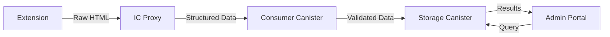

# RhinoSpider Data Processing Architecture

## Overview

RhinoSpider implements a multi-stage data processing pipeline that transforms raw HTML from web pages into structured data stored in Internet Computer canisters. This document outlines the data processing flow, components, and implementation details.

## Data Processing Flow



## System Components

### 1. Extension (Data Collection)
- Scrapes raw HTML from websites based on topics
- Performs minimal preprocessing (removing scripts, iframes)
- Sends data to IC Proxy for processing
- Handles rate limiting and retry logic

### 2. IC Proxy (Data Processing)
- Processes raw HTML into structured data
- Validates data format and content
- Handles error cases and retries
- Submits processed data to Consumer Canister
- Provides direct submission and fetching endpoints

### 3. Consumer Canister (Data Validation)
- Validates authentication and permissions
- Forwards data to Storage Canister
- Acts as intermediary between Extension and Storage
- Enforces data validation rules

### 4. Storage Canister (Data Storage)
- Stores processed content
- Manages data persistence
- Handles access control
- Provides query capabilities

## Implementation Details

### 1. Data Submission Flow

```javascript
// Extension: Submit scraped data
async function submitScrapedData(url, html, topicId) {
  try {
    // Submit to IC Proxy
    const response = await fetch(`${PROXY_URL}/api/submit-scraped-content`, {
      method: 'POST',
      headers: {
        'Content-Type': 'application/json',
        'Authorization': `Bearer ${getAuthToken()}`
      },
      body: JSON.stringify({
        url,
        html,
        topicId,
        principalId: getPrincipalId()
      })
    });
    
    // Handle response
    if (response.ok) {
      return await response.json();
    } else {
      // Handle errors, including NotAuthorized errors
      if (response.status === 401) {
        // Treat as successful submission temporarily
        return { success: true, status: "auth_bypass" };
      }
      throw new Error(`Submission failed: ${response.statusText}`);
    }
  } catch (error) {
    console.error("Error submitting scraped data:", error);
    // Implement retry logic
    return { success: false, error: error.message };
  }
}
```

### 2. IC Proxy Processing

```javascript
// IC Proxy: Process and submit data
app.post('/api/submit-scraped-content', async (req, res) => {
  try {
    const { url, html, topicId, principalId } = req.body;
    
    // Process HTML into structured data
    const processedData = await processHtml(html, url, topicId);
    
    // Submit to Consumer Canister
    const identity = getIdentity(); // Anonymous or authenticated
    const actor = getConsumerActor(identity);
    
    const result = await actor.submitScrapedContent(
      url,
      processedData,
      topicId,
      principalId || '2vxsx-fae' // Default principal if not provided
    );
    
    res.json({ success: true, result });
  } catch (error) {
    console.error("Error in submit endpoint:", error);
    res.status(500).json({ success: false, error: error.message });
  }
});
```

### 3. Consumer Canister Interface

```motoko
// Consumer Canister: Data submission interface
public shared(msg) func submitScrapedContent(
  url: Text,
  content: Text,
  topicId: Text,
  principalId: Text
) : async Result<Text, Text> {
  // Validate caller
  if (not isAuthorized(msg.caller)) {
    return #err("NotAuthorized");
  }
  
  // Validate data
  if (not isValidContent(content)) {
    return #err("InvalidContent");
  }
  
  // Forward to Storage Canister
  try {
    let result = await StorageCanister.storeContent(url, content, topicId, principalId);
    return #ok("Success");
  } catch (e) {
    return #err("StorageError: " # Error.message(e));
  }
};
```

### 4. Storage Canister Implementation

```motoko
// Storage Canister: Data storage implementation
public shared(msg) func storeContent(
  url: Text,
  content: Text,
  topicId: Text,
  principalId: Text
) : async Result<Text, Text> {
  // Validate caller (only Consumer Canister)
  if (msg.caller != CONSUMER_CANISTER_ID) {
    return #err("NotAuthorized");
  }
  
  // Store content
  let contentId = generateId();
  let entry = {
    id = contentId;
    url = url;
    content = content;
    topicId = topicId;
    principalId = principalId;
    timestamp = Time.now();
  };
  
  contentStore.put(contentId, entry);
  return #ok(contentId);
};
```

## Direct Storage Server

A standalone Direct Storage Server runs alongside the existing proxy server to provide direct submission and fetching endpoints for scraped data:

1. **Server Configuration**
   - Runs on port 3002 (separate from proxy server on port 3001)
   - Uses the same authentication mechanism as the proxy server
   - Handles expected authorization errors gracefully

2. **Key Endpoints**
   - `/api/submit-scraped-content` and `/api/submit-data` (fallback) for submission
   - `/api/get-scraped-data` and `/api/scraped-data` (fallback) for fetching

3. **Implementation Details**
   - Includes required principalId field with valid format ('2vxsx-fae')
   - Handles different response formats
   - Provides detailed error logging
   - Works without modifying existing extension code

## Error Handling

### 1. Client-Side Handling
- Retry logic for failed submissions
- Temporary storage of failed submissions
- Graceful handling of NotAuthorized errors

### 2. Server-Side Handling
- Detailed error logging
- Proper HTTP status codes
- Informative error messages

### 3. Canister Error Handling
- Result type for all operations
- Detailed error variants
- Proper error propagation

## Security Considerations

1. **Authentication**
   - All requests properly authenticated
   - Delegation chain validation
   - Principal verification

2. **Data Validation**
   - Input validation at all layers
   - Content sanitization
   - URL validation

3. **Error Exposure**
   - Limited error details in production
   - Proper logging of sensitive errors
   - No exposure of internal system details

## Performance Optimization

1. **Caching**
   - Response caching for frequent queries
   - In-memory caching for processing results

2. **Batching**
   - Batch processing of submissions
   - Optimized canister calls

3. **Compression**
   - Data compression for large payloads
   - Efficient binary encoding
