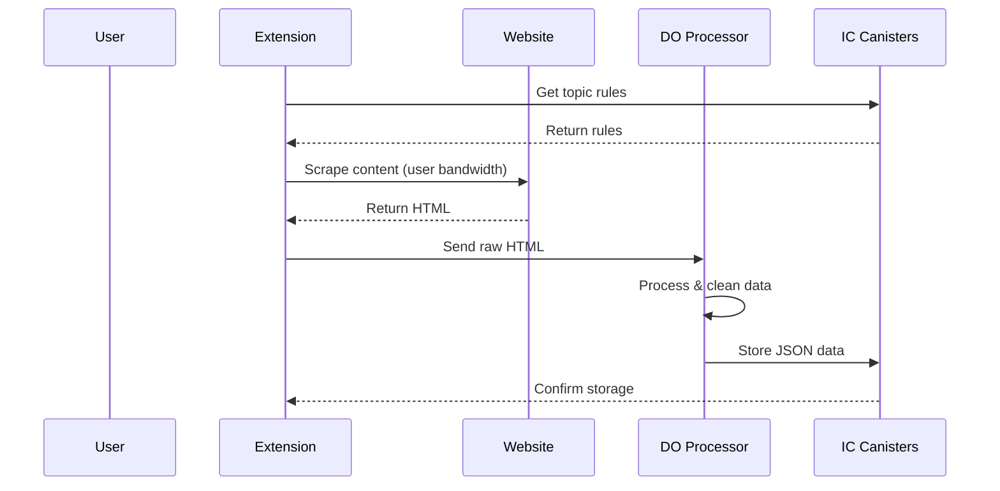

# RhinoSpider Scraping Architecture

## Overview

RhinoSpider implements a distributed web scraping system where scraping happens on users' devices to utilize their bandwidth, with a Digital Ocean (DO) service for data processing. This design solves several key challenges:
- Distributed scraping load across user devices
- Reliable data processing and cleaning
- Consistent data format
- Scalable processing

## System Components

### 1. Admin Portal (IC Canister)
- Manages scraping topics and rules
- Defines extraction patterns
- Views and analyzes collected data
- Handles user permissions
- Monitors system health

### 2. Extension (User Device)
- Chrome extension for scraping
- Performs actual web scraping using user's bandwidth
- Gets topics and rules from admin canister
- Sends raw HTML to DO for processing
- Operates completely in background after user enables it

### 3. Digital Ocean Processing Service
- Processes and cleans raw HTML from extensions
- Features:
  - Converts HTML to structured JSON
  - Validates data format
  - Handles error cases
  - Sends clean data to storage canister
- Components:
  - Express.js server
  - Redis for queue management
  - Docker containers for isolation

### 4. Storage Canister (IC)
- Stores processed content
- Manages data persistence
- Handles access control
- Provides data to admin portal

## Data Flow



## Implementation Details

### 1. Extension Scraping
- Uses fetch API for scraping
- Runs in background service worker
- Manages scraping intervals
- Handles rate limiting locally
- Uses user's bandwidth for actual scraping

### 2. Digital Ocean Setup
```bash
# Server Requirements
- Ubuntu 22.04 LTS
- Docker & Docker Compose
- Node.js 18+
- 1GB RAM minimum
- 25GB SSD

# Key Components
/opt/rhinospider-scraper/
├── docker-compose.yml    # Service orchestration
├── Dockerfile           # Node.js setup
├── src/
│   └── index.js        # HTML processing service
└── package.json        # Dependencies
```

### 3. Security Considerations
- Extension only scrapes allowed domains
- DO service only accepts requests from authenticated extensions
- All sensitive data stored in IC canisters
- DO service processes data and forwards to storage

### 4. Error Handling
- Extension handles scraping errors
- DO service handles processing errors
- Queue-based processing
- Error reporting to IC canister

### 5. Scaling
- Natural scaling through distributed user base
- Each user device handles its own scraping
- DO service scales for processing only
- Load balanced across user base

## Analytics & Monitoring

### 1. Metrics Tracked
- Scraping success rate per user
- Processing time
- Error rates
- User contribution metrics

### 2. Monitoring
- Real-time status dashboard
- Error alerts
- Performance metrics
- User activity tracking

## Privacy Considerations

### 1. User Data
- Extension NEVER accesses:
  - User's browsing history
  - User's open tabs
  - User's current pages
  - Any personal user data
  - Browser navigation

### 2. Scraping Behavior
- ONLY works as a background process
- ONLY works based on topics coming from the server
- NEVER opens new tabs
- NEVER opens new pages
- NEVER accesses what the user is browsing
- NEVER scans the browser

## Future Improvements

### 1. Enhanced Topic Structure
- Additional fields for better URL generation:
  - articleUrlPatterns: Array of specific article URL patterns
  - siteTypeClassification: Type of website (blog, news, etc.)
  - contentIdentifiers: Selectors to identify content-rich pages
  - paginationPatterns: Pagination patterns for the site
  - sampleArticleUrls: Known good article URLs
  - urlGenerationStrategy: Preferred URL generation approach
  - excludePatterns: URL patterns to avoid

### 2. AI-Assisted Scraping
- Content extraction and structuring
- Field-specific processing
- Handling inconsistent layouts
