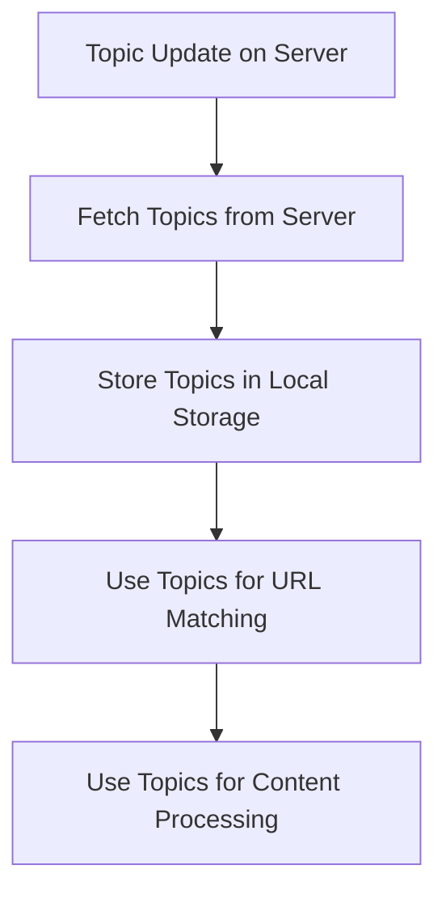
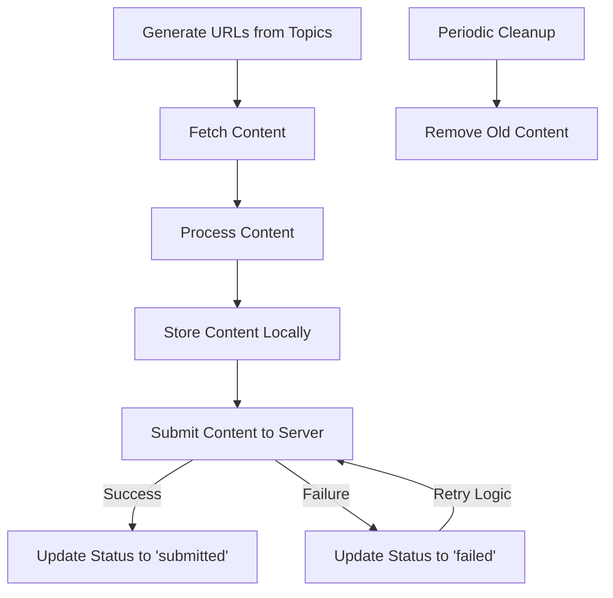
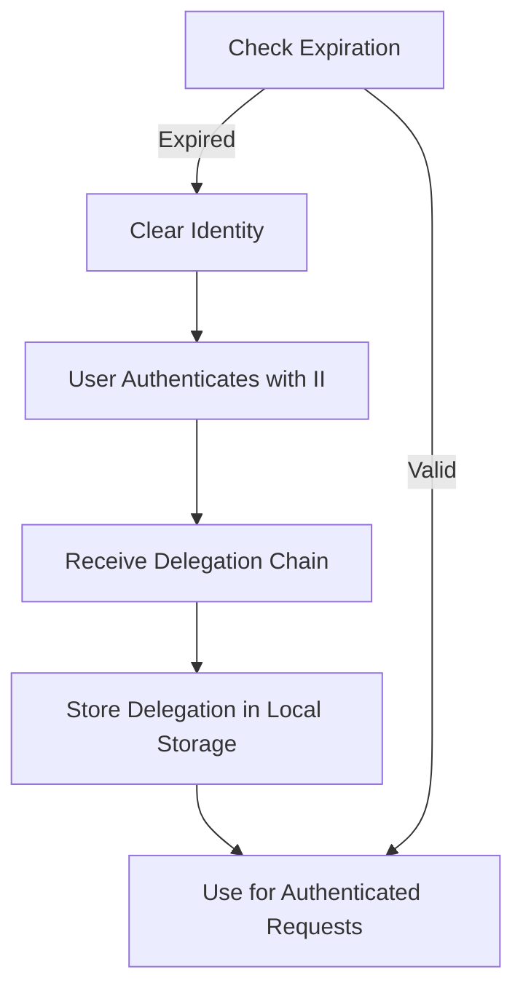

# RhinoSpider Extension Data Structure

## Overview

The RhinoSpider extension implements a structured data model for managing topics, scraped content, and authentication information. This document outlines the data structures, storage mechanisms, and data lifecycle within the extension.

## Core Data Structures

### 1. Topic Structure

```typescript
interface Topic {
  id: string;               // Unique identifier
  name: string;             // Display name
  description: string;      // Description
  urlPatterns: string[];    // URL patterns for matching
  articleUrlPatterns?: string[];  // Specific article URL patterns
  sampleArticleUrls?: string[];   // Sample article URLs
  contentIdentifiers?: {    // Content identification rules
    selectors?: string[];   // CSS selectors for content extraction
    patterns?: string[];    // Regex patterns for content matching
  };
  fields?: Field[];         // Data fields to extract
  active: boolean;          // Whether topic is active
  priority?: number;        // Processing priority (1-10)
  lastUpdated: number;      // Timestamp of last update
}

interface Field {
  name: string;             // Field name
  type: 'text' | 'number' | 'date' | 'list' | 'boolean';
  required: boolean;        // Whether field is required
  prompt?: string;          // AI prompt for extraction
}
```

### 2. Scraped Content Structure

```typescript
interface ScrapedContent {
  id: string;               // Generated content ID
  url: string;              // Source URL
  html: string;             // Raw HTML content
  topicId: string;          // Associated topic ID
  timestamp: number;        // Scrape timestamp
  status: 'pending' | 'submitted' | 'failed';
  retryCount?: number;      // Number of submission attempts
  error?: string;           // Error message if failed
  processingResult?: any;   // Processing result if any
}
```

### 3. Authentication Structure

```typescript
interface StoredIdentity {
  delegations: {
    delegation: {
      pubkey: number[];     // Public key as array
      expiration: string;   // Expiration as hex string
      targets?: string[];   // Optional target restrictions
    };
    signature: number[];    // Signature as array
  }[];
  publicKey: number[];      // Public key as array
  principalId?: string;     // Principal ID if available
}
```

## Storage Mechanisms

The extension uses Chrome's storage API with different storage areas for different types of data:

### 1. Chrome Storage Areas

```javascript
// Local storage for authentication and settings
chrome.storage.local.set({ key: value });
chrome.storage.local.get(['key'], result => { /* use result.key */ });

// Sync storage for user preferences
chrome.storage.sync.set({ key: value });
chrome.storage.sync.get(['key'], result => { /* use result.key */ });

// Session storage for temporary data
chrome.storage.session.set({ key: value });
chrome.storage.session.get(['key'], result => { /* use result.key */ });
```

### 2. Storage Utility Functions

```javascript
// Storage utility module
const StorageUtil = {
  // Store topics
  async storeTopics(topics) {
    return chrome.storage.local.set({ 'topics': topics });
  },
  
  // Get topics
  async getTopics() {
    return new Promise(resolve => {
      chrome.storage.local.get(['topics'], result => {
        resolve(result.topics || []);
      });
    });
  },
  
  // Store scraped content
  async storeScrapedContent(content) {
    return new Promise(resolve => {
      chrome.storage.local.get(['scrapedContent'], result => {
        const existingContent = result.scrapedContent || [];
        existingContent.push(content);
        chrome.storage.local.set({ 'scrapedContent': existingContent }, () => {
          resolve();
        });
      });
    });
  },
  
  // Get scraped content
  async getScrapedContent() {
    return new Promise(resolve => {
      chrome.storage.local.get(['scrapedContent'], result => {
        resolve(result.scrapedContent || []);
      });
    });
  },
  
  // Update scraped content status
  async updateContentStatus(contentId, status, error = null) {
    return new Promise(resolve => {
      chrome.storage.local.get(['scrapedContent'], result => {
        const existingContent = result.scrapedContent || [];
        const updatedContent = existingContent.map(content => {
          if (content.id === contentId) {
            return {
              ...content,
              status,
              error,
              lastUpdated: Date.now()
            };
          }
          return content;
        });
        chrome.storage.local.set({ 'scrapedContent': updatedContent }, () => {
          resolve();
        });
      });
    });
  },
  
  // Store identity
  async storeIdentity(identity) {
    return chrome.storage.local.set({ 'identity': identity });
  },
  
  // Get identity
  async getIdentity() {
    return new Promise(resolve => {
      chrome.storage.local.get(['identity'], result => {
        resolve(result.identity || null);
      });
    });
  },
  
  // Clear identity
  async clearIdentity() {
    return chrome.storage.local.remove(['identity']);
  }
};
```

## Data Lifecycle

### 1. Topic Data Lifecycle



**Implementation Details:**

```javascript
// Fetch and store topics
async function refreshTopics() {
  try {
    // Fetch topics from server
    const topics = await fetchTopics();
    
    // Store topics in local storage
    await StorageUtil.storeTopics(topics);
    
    console.log(`Refreshed ${topics.length} topics`);
    return topics;
  } catch (error) {
    console.error("Error refreshing topics:", error);
    
    // Use cached topics if available
    const cachedTopics = await StorageUtil.getTopics();
    return cachedTopics;
  }
}

// Schedule periodic topic refresh
function scheduleTopicRefresh(intervalMinutes = 60) {
  // Clear any existing alarm
  chrome.alarms.clear('refreshTopics');
  
  // Create new alarm
  chrome.alarms.create('refreshTopics', {
    periodInMinutes: intervalMinutes
  });
  
  // Handle alarm
  chrome.alarms.onAlarm.addListener(alarm => {
    if (alarm.name === 'refreshTopics') {
      refreshTopics();
    }
  });
  
  // Initial refresh
  refreshTopics();
}
```

### 2. Scraped Content Lifecycle



**Implementation Details:**

```javascript
// Scrape content for a topic
async function scrapeContentForTopic(topic) {
  try {
    // Generate URLs from topic
    const urls = generateUrlsFromTopic(topic);
    
    // Process each URL
    for (const url of urls) {
      // Check if URL already scraped recently
      const recentlyScrapped = await checkRecentlyScrapped(url);
      if (recentlyScrapped) {
        console.log(`Skipping recently scraped URL: ${url}`);
        continue;
      }
      
      // Fetch content
      const result = await fetchPageContent(url);
      if (!result.success) {
        console.error(`Failed to fetch ${url}:`, result.error);
        continue;
      }
      
      // Process content
      const processedContent = processContent(result.html, url, topic);
      
      // Generate content ID
      const contentId = generateContentId();
      
      // Store content locally
      await StorageUtil.storeScrapedContent({
        id: contentId,
        url,
        html: result.html,
        topicId: topic.id,
        timestamp: Date.now(),
        status: 'pending'
      });
      
      // Submit content to server
      submitContentWithRetry(contentId, url, result.html, topic.id);
    }
  } catch (error) {
    console.error(`Error scraping content for topic ${topic.name}:`, error);
  }
}

// Submit content with retry logic
async function submitContentWithRetry(contentId, url, html, topicId, maxRetries = 3) {
  let retryCount = 0;
  
  while (retryCount < maxRetries) {
    try {
      // Submit content
      const result = await submitScrapedData(url, html, topicId);
      
      if (result.success) {
        // Update status to submitted
        await StorageUtil.updateContentStatus(contentId, 'submitted');
        return;
      }
      
      // Increment retry count
      retryCount++;
      
      // Update status with error
      await StorageUtil.updateContentStatus(
        contentId, 
        retryCount >= maxRetries ? 'failed' : 'pending',
        result.error
      );
      
      // Wait before retrying
      await new Promise(resolve => setTimeout(resolve, 2000 * retryCount));
    } catch (error) {
      console.error(`Error submitting content (attempt ${retryCount + 1}):`, error);
      
      // Increment retry count
      retryCount++;
      
      // Update status with error
      await StorageUtil.updateContentStatus(
        contentId, 
        retryCount >= maxRetries ? 'failed' : 'pending',
        error.message
      );
      
      // Wait before retrying
      await new Promise(resolve => setTimeout(resolve, 2000 * retryCount));
    }
  }
}

// Cleanup old content
async function cleanupOldContent(maxAgeHours = 24) {
  try {
    // Get all scraped content
    const allContent = await StorageUtil.getScrapedContent();
    
    // Calculate cutoff time
    const cutoffTime = Date.now() - (maxAgeHours * 60 * 60 * 1000);
    
    // Filter out old content
    const newContent = allContent.filter(content => {
      // Keep content newer than cutoff
      return content.timestamp > cutoffTime;
    });
    
    // Store updated content list
    await chrome.storage.local.set({ 'scrapedContent': newContent });
    
    console.log(`Cleaned up ${allContent.length - newContent.length} old content items`);
  } catch (error) {
    console.error("Error cleaning up old content:", error);
  }
}
```

### 3. Authentication Data Lifecycle



**Implementation Details:**

```javascript
// Store identity after authentication
async function storeIdentity(delegationChain) {
  // Format delegation chain for storage
  const storedIdentity = {
    delegations: delegationChain.delegations.map(d => ({
      delegation: {
        pubkey: Array.from(d.delegation.pubkey),
        expiration: d.delegation.expiration.toString(16), // Store as hex
        targets: d.delegation.targets || []
      },
      signature: Array.from(d.signature)
    })),
    publicKey: Array.from(delegationChain.publicKey)
  };
  
  // Extract principal ID if available
  try {
    const identity = createIdentityFromDelegation(delegationChain);
    storedIdentity.principalId = identity.getPrincipal().toString();
  } catch (error) {
    console.error("Error extracting principal ID:", error);
  }
  
  // Store in local storage
  await StorageUtil.storeIdentity(storedIdentity);
}

// Recreate identity from stored data
async function recreateIdentity() {
  try {
    // Get stored identity
    const storedIdentity = await StorageUtil.getIdentity();
    if (!storedIdentity) {
      return null;
    }
    
    // Check if expired
    const isExpired = checkIdentityExpired(storedIdentity);
    if (isExpired) {
      await StorageUtil.clearIdentity();
      return null;
    }
    
    // Recreate delegation chain
    const delegationChain = {
      delegations: storedIdentity.delegations.map(d => ({
        delegation: {
          pubkey: new Uint8Array(d.delegation.pubkey),
          expiration: BigInt(`0x${d.delegation.expiration}`), // Parse hex to BigInt
          targets: d.delegation.targets || []
        },
        signature: new Uint8Array(d.signature)
      })),
      publicKey: new Uint8Array(storedIdentity.publicKey)
    };
    
    // Create identity
    return createIdentityFromDelegation(delegationChain);
  } catch (error) {
    console.error("Error recreating identity:", error);
    return null;
  }
}

// Check if identity is expired
function checkIdentityExpired(storedIdentity) {
  try {
    // Get earliest expiration time
    const earliestExpiration = storedIdentity.delegations.reduce((earliest, d) => {
      const expiration = BigInt(`0x${d.delegation.expiration}`);
      return earliest === null || expiration < earliest ? expiration : earliest;
    }, null);
    
    if (earliestExpiration === null) {
      return true;
    }
    
    // Convert to milliseconds and compare with current time
    const expirationMs = Number(earliestExpiration / BigInt(1000000)); // Convert from nanoseconds
    return Date.now() > expirationMs;
  } catch (error) {
    console.error("Error checking identity expiration:", error);
    return true; // Assume expired on error
  }
}
```

## Data Persistence Strategy

### 1. Persistence Tiers

The extension implements a tiered persistence strategy:

1. **Short-term Storage**
   - In-memory for active processing
   - Session storage for temporary data

2. **Medium-term Storage**
   - Local storage for topics, content, and authentication
   - Persists across browser restarts

3. **Long-term Storage**
   - Server-side storage via content submission
   - Sync storage for user preferences

### 2. Cleanup Strategy

```javascript
// Schedule periodic cleanup
function scheduleCleanup(intervalHours = 6) {
  // Clear any existing alarm
  chrome.alarms.clear('cleanup');
  
  // Create new alarm
  chrome.alarms.create('cleanup', {
    periodInMinutes: intervalHours * 60
  });
  
  // Handle alarm
  chrome.alarms.onAlarm.addListener(alarm => {
    if (alarm.name === 'cleanup') {
      // Cleanup old content
      cleanupOldContent();
      
      // Check and clear expired identity
      checkAndClearExpiredIdentity();
    }
  });
}

// Check and clear expired identity
async function checkAndClearExpiredIdentity() {
  try {
    // Get stored identity
    const storedIdentity = await StorageUtil.getIdentity();
    if (!storedIdentity) {
      return;
    }
    
    // Check if expired
    const isExpired = checkIdentityExpired(storedIdentity);
    if (isExpired) {
      console.log("Clearing expired identity");
      await StorageUtil.clearIdentity();
    }
  } catch (error) {
    console.error("Error checking identity expiration:", error);
  }
}
```

## Data Security

### 1. Sensitive Data Handling

```javascript
// Secure storage for sensitive data
const SecureStorage = {
  // Encrypt data before storage
  async encrypt(data, key) {
    // Implementation depends on security requirements
    // This is a simplified example
    const encoder = new TextEncoder();
    const dataBuffer = encoder.encode(JSON.stringify(data));
    
    // Use Web Crypto API for encryption
    const cryptoKey = await this.deriveCryptoKey(key);
    const iv = crypto.getRandomValues(new Uint8Array(12));
    
    const encryptedData = await crypto.subtle.encrypt(
      { name: 'AES-GCM', iv },
      cryptoKey,
      dataBuffer
    );
    
    return {
      data: Array.from(new Uint8Array(encryptedData)),
      iv: Array.from(iv)
    };
  },
  
  // Decrypt data after retrieval
  async decrypt(encryptedObj, key) {
    // Implementation depends on security requirements
    // This is a simplified example
    const cryptoKey = await this.deriveCryptoKey(key);
    
    const decryptedData = await crypto.subtle.decrypt(
      { name: 'AES-GCM', iv: new Uint8Array(encryptedObj.iv) },
      cryptoKey,
      new Uint8Array(encryptedObj.data)
    );
    
    const decoder = new TextDecoder();
    return JSON.parse(decoder.decode(decryptedData));
  },
  
  // Derive crypto key from password
  async deriveCryptoKey(password) {
    const encoder = new TextEncoder();
    const passwordBuffer = encoder.encode(password);
    
    const keyMaterial = await crypto.subtle.importKey(
      'raw',
      passwordBuffer,
      { name: 'PBKDF2' },
      false,
      ['deriveKey']
    );
    
    return crypto.subtle.deriveKey(
      {
        name: 'PBKDF2',
        salt: encoder.encode('RhinoSpider'),
        iterations: 100000,
        hash: 'SHA-256'
      },
      keyMaterial,
      { name: 'AES-GCM', length: 256 },
      false,
      ['encrypt', 'decrypt']
    );
  }
};
```

### 2. Data Access Controls

```javascript
// Permission checking
function hasPermission(permission) {
  return new Promise(resolve => {
    chrome.permissions.contains({ permissions: [permission] }, result => {
      resolve(result);
    });
  });
}

// Request permission
function requestPermission(permission) {
  return new Promise(resolve => {
    chrome.permissions.request({ permissions: [permission] }, granted => {
      resolve(granted);
    });
  });
}
```

## Best Practices

1. **Minimize Storage Usage**
   - Only store essential data
   - Implement cleanup strategies
   - Use appropriate storage areas

2. **Handle Storage Quotas**
   - Check available space before storage
   - Implement fallback strategies
   - Prioritize critical data

3. **Secure Sensitive Data**
   - Use encryption for sensitive data
   - Clear sensitive data when not needed
   - Implement proper authentication checks

4. **Optimize Performance**
   - Batch storage operations
   - Use indexing for faster lookups
   - Implement caching strategies

5. **Handle Errors Gracefully**
   - Implement proper error handling
   - Provide fallback mechanisms
   - Log errors for debugging

## Limitations and Considerations

1. **Storage Limits**
   - Chrome storage has quota limitations
   - Local storage: ~5MB per extension
   - Sync storage: ~100KB per extension

2. **Performance Considerations**
   - Storage operations are asynchronous
   - Large data sets can impact performance
   - Consider chunking large data

3. **Security Considerations**
   - Storage is not encrypted by default
   - Sensitive data should be encrypted
   - Clear sensitive data when not needed

4. **Compatibility Considerations**
   - Different browsers have different limitations
   - Consider cross-browser compatibility
   - Test on different platforms
