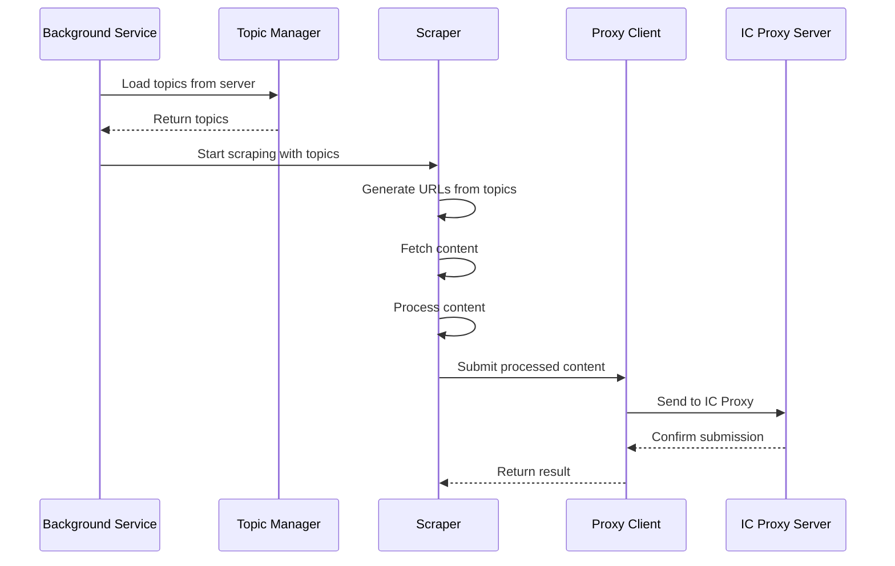

# RhinoSpider Extension Scraping Implementation

## Overview

The RhinoSpider extension implements a privacy-focused background scraping system that operates based on topics provided by the server. This document outlines the implementation details, privacy considerations, and security measures.

## Privacy-First Design

### Critical Privacy Restrictions

1. **DO NOT Access User Data**
   - NEVER access user's browsing history
   - NEVER access user's open tabs
   - NEVER access user's current pages
   - NEVER access any personal user data
   - NEVER access browser navigation

2. **Background-Only Operation**
   - ONLY work as a background process
   - ONLY work based on topics coming from the server
   - NEVER open new tabs
   - NEVER open new pages
   - NEVER scan the browser

## Implementation Architecture

### 1. Core Components

```
extension/
├── background.js       # Main background service worker
├── scraper/
│   ├── scraper.js      # Core scraping functionality
│   ├── processor.js    # Content processing
│   └── submitter.js    # Data submission
├── utils/
│   ├── auth.js         # Authentication utilities
│   ├── storage.js      # Storage utilities
│   └── logger.js       # Logging utilities
└── proxy/
    └── proxy-client.js # Communication with IC Proxy
```

### 2. Scraping Process Flow



## URL Generation

### 1. Topic-Based URL Generation

URLs are generated based on topic configurations from the server:

```javascript
function generateUrlsFromTopic(topic) {
  const urls = [];
  
  // Use articleUrlPatterns if available
  if (topic.articleUrlPatterns && topic.articleUrlPatterns.length > 0) {
    // Generate URLs from patterns
    const baseUrl = topic.urlPatterns[0];
    topic.articleUrlPatterns.forEach(pattern => {
      urls.push(baseUrl + pattern.replace('*', generateRandomPath()));
    });
  }
  
  // Use sampleArticleUrls if available
  if (topic.sampleArticleUrls && topic.sampleArticleUrls.length > 0) {
    urls.push(...topic.sampleArticleUrls);
  }
  
  // Use search proxy service if needed
  if (urls.length === 0) {
    urls.push(`http://143.244.133.154:3003/api/search?topic=${encodeURIComponent(topic.name)}`);
  }
  
  return urls;
}
```

### 2. Search Proxy Integration

For topics without specific URL patterns, the extension uses a dedicated search proxy service:

```javascript
async function getUrlsFromSearchProxy(topic) {
  try {
    const response = await fetch(`http://143.244.133.154:3003/api/search?topic=${encodeURIComponent(topic.name)}`);
    if (response.ok) {
      const data = await response.json();
      return data.urls || [];
    }
    return [];
  } catch (error) {
    console.error("Error fetching URLs from search proxy:", error);
    return [];
  }
}
```

## Content Scraping

### 1. Fetch Implementation

```javascript
async function fetchPageContent(url) {
  try {
    const response = await fetch(url);
    if (!response.ok) {
      throw new Error(`HTTP error! status: ${response.status}`);
    }
    const html = await response.text();
    return { success: true, html, url };
  } catch (error) {
    console.error(`Error fetching ${url}:`, error);
    return { success: false, error: error.message, url };
  }
}
```

### 2. Content Processing

```javascript
function processContent(html, url, topic) {
  // Basic preprocessing
  const cleanHtml = removeScripts(html);
  
  // Extract content based on topic rules
  let content = extractContent(cleanHtml, topic);
  
  // Format for submission
  return {
    url,
    content,
    topicId: topic.id,
    timestamp: Date.now()
  };
}

function extractContent(html, topic) {
  let content = html;
  
  // Use content identifiers if available
  if (topic.contentIdentifiers) {
    if (topic.contentIdentifiers.selectors && topic.contentIdentifiers.selectors.length > 0) {
      // Extract content using selectors
      const parser = new DOMParser();
      const doc = parser.parseFromString(html, 'text/html');
      
      for (const selector of topic.contentIdentifiers.selectors) {
        const element = doc.querySelector(selector);
        if (element) {
          content = element.outerHTML;
          break;
        }
      }
    }
  }
  
  return content;
}
```

## Data Submission

### 1. Submission Process

```javascript
async function submitScrapedData(url, html, topicId) {
  try {
    // Submit to IC Proxy
    const response = await fetch(`${PROXY_URL}/api/submit-scraped-content`, {
      method: 'POST',
      headers: {
        'Content-Type': 'application/json',
        'Authorization': `Bearer ${getAuthToken()}`
      },
      body: JSON.stringify({
        url,
        html,
        topicId,
        principalId: getPrincipalId()
      })
    });
    
    // Handle response
    if (response.ok) {
      return await response.json();
    } else {
      // Handle errors, including NotAuthorized errors
      if (response.status === 401) {
        // Treat as successful submission temporarily
        return { success: true, status: "auth_bypass" };
      }
      throw new Error(`Submission failed: ${response.statusText}`);
    }
  } catch (error) {
    console.error("Error submitting scraped data:", error);
    // Implement retry logic
    return { success: false, error: error.message };
  }
}
```

### 2. Retry Logic

```javascript
async function submitWithRetry(url, html, topicId, maxRetries = 3) {
  let retries = 0;
  let lastError = null;
  
  while (retries < maxRetries) {
    try {
      const result = await submitScrapedData(url, html, topicId);
      if (result.success) {
        return result;
      }
      lastError = new Error(result.error || "Unknown error");
    } catch (error) {
      lastError = error;
    }
    
    retries++;
    await new Promise(resolve => setTimeout(resolve, 2000 * retries)); // Exponential backoff
  }
  
  console.error(`Failed to submit after ${maxRetries} retries:`, lastError);
  return { success: false, error: lastError.message };
}
```

## Testing Functionality

For development and testing purposes, the extension includes a test function that can be used to test the scraping functionality with specific URLs:

```javascript
// Test function for scraping a specific URL
async function testScrapeUrl(url) {
  try {
    console.log(`Testing scrape for URL: ${url}`);
    
    // Fetch content
    const result = await fetchPageContent(url);
    if (!result.success) {
      console.error("Failed to fetch content:", result.error);
      return { success: false, error: result.error };
    }
    
    // Find matching topics
    const topics = await getTopics();
    const matchingTopics = findMatchingTopicsForUrl(url, topics);
    
    if (matchingTopics.length === 0) {
      console.warn("No matching topics found for URL");
      return { success: false, error: "No matching topics" };
    }
    
    // Process and submit for each matching topic
    const results = [];
    for (const topic of matchingTopics) {
      const processedData = processContent(result.html, url, topic);
      const submitResult = await submitWithRetry(url, result.html, topic.id);
      results.push({
        topic: topic.name,
        success: submitResult.success,
        result: submitResult
      });
    }
    
    return { success: true, results };
  } catch (error) {
    console.error("Error in test scrape:", error);
    return { success: false, error: error.message };
  }
}
```

## Security Considerations

### 1. Authentication

- All requests to the IC Proxy are authenticated using Internet Identity
- Delegation chain is properly maintained and validated
- No anonymous access in production

### 2. Data Handling

- Content is processed locally before submission
- No sensitive user data is collected or transmitted
- All data is related only to the topics provided by the server

### 3. Error Handling

- Detailed error logging for debugging
- Graceful handling of network errors
- Retry logic for intermittent failures

## Best Practices

1. Always verify URL against topic patterns before scraping
2. Implement rate limiting to avoid overloading servers
3. Handle errors gracefully and implement retry logic
4. Never access user browsing data or open tabs
5. Only scrape content based on server-provided topics
6. Process content locally before submission
7. Authenticate all requests to the IC Proxy

## Future Improvements

1. Enhanced topic structure with additional fields:
   - articleUrlPatterns: Array of specific article URL patterns
   - siteTypeClassification: Type of website (blog, news, etc.)
   - contentIdentifiers: Selectors to identify content-rich pages
   - paginationPatterns: Pagination patterns for the site
   - sampleArticleUrls: Known good article URLs
   - urlGenerationStrategy: Preferred URL generation approach
   - excludePatterns: URL patterns to avoid

2. AI-assisted content extraction:
   - Field-specific processing
   - Handling inconsistent layouts
   - Better content identification
