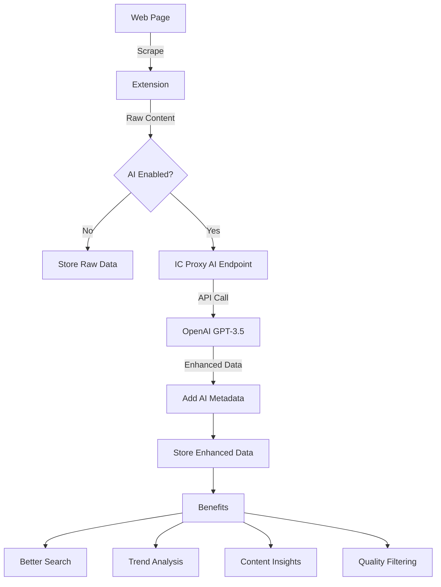

# AI Integration in RhinoSpider DePIN System

## Overview
RhinoSpider's AI integration enhances web scraping quality and provides intelligent data processing for better insights. The AI is **completely optional** and disabled by default to keep costs minimal.

## How AI Enhances Web Scraping

### 1. Content Summarization
**Problem Solved**: Raw scraped content is often lengthy and contains irrelevant information.

**How AI Helps**:
- Automatically generates 2-3 sentence summaries of scraped articles
- Captures the essence of long-form content
- Makes it easier to quickly understand what was scraped
- Useful for creating digest reports or quick overviews

**Example**:
```
Original: 2000-word article about DePIN infrastructure
AI Summary: "DePIN networks are revolutionizing infrastructure by decentralizing physical resources. The technology enables community-owned networks that reduce costs by 80% compared to traditional models. Major players like Helium and Filecoin are leading adoption."
```

### 2. Keyword Extraction
**Problem Solved**: Manually identifying important terms is time-consuming and inconsistent.

**How AI Helps**:
- Automatically extracts 5-10 most important keywords
- Identifies technical terms, entities, and concepts
- Improves searchability and categorization
- Helps identify trends across multiple scraped pages

**Example**:
```
Scraped Content: Article about blockchain infrastructure
AI Keywords: ["DePIN", "blockchain", "decentralization", "Helium", "IoT sensors", "proof-of-coverage", "token rewards", "network validators"]
```

### 3. Content Categorization
**Problem Solved**: Organizing scraped content into meaningful categories is difficult at scale.

**How AI Helps**:
- Automatically categorizes content into predefined categories
- Ensures consistent classification across all scraped data
- Makes filtering and analysis easier
- Helps identify content relevance to specific topics

**Categories**: Technology, Business, Science, Health, Entertainment, Sports, Politics, Other

### 4. Sentiment Analysis
**Problem Solved**: Understanding market sentiment and public opinion requires manual analysis.

**How AI Helps**:
- Analyzes emotional tone of scraped content
- Identifies positive, negative, or neutral sentiment
- Useful for tracking brand perception or market sentiment
- Helps identify controversial or trending topics

**Example**:
```
Article about new DePIN project: Sentiment = "positive"
Article about regulatory concerns: Sentiment = "negative"
Technical documentation: Sentiment = "neutral"
```

## Benefits for Data Quality

### 1. **Improved Data Structure**
- Raw HTML → Clean, structured data with metadata
- Consistent formatting across all sources
- Enhanced with AI-generated insights

### 2. **Better Search and Discovery**
- AI-extracted keywords improve search accuracy
- Categories enable better filtering
- Summaries provide quick content preview

### 3. **Trend Analysis**
- Sentiment tracking over time
- Keyword frequency analysis
- Category distribution insights

### 4. **Reduced Noise**
- AI helps identify and filter irrelevant content
- Focuses on extracting meaningful information
- Reduces storage of duplicate or low-value content

## Cost Optimization

### AI is Optional and Cost-Effective
1. **Disabled by Default**: No AI costs unless explicitly enabled
2. **Cheapest Model**: Uses GPT-3.5-turbo (≈$0.001 per 1K tokens)
3. **Selective Processing**: Can enable only needed features
4. **Token Limits**: Configurable max tokens per request (default: 150)

### Cost Breakdown Example
For 1000 scraped pages with all features enabled:
- Average content: 500 words per page
- AI processing: ~200 tokens per page
- Total tokens: 200,000 tokens
- **Estimated cost: $0.20**

## Configuration

### Global AI Settings (Admin Dashboard)
```javascript
{
  enabled: false,           // Off by default
  provider: "openai",       // Real OpenAI API
  apiKey: "sk-...",        // User's API key
  model: "gpt-3.5-turbo",  // Cheapest model
  maxTokensPerRequest: 150,
  features: {
    summarization: true,
    keywordExtraction: true,
    categorization: true,
    sentimentAnalysis: true
  }
}
```

### How to Enable AI
1. Go to Admin Dashboard: https://sxsvc-aqaaa-aaaaj-az4ta-cai.icp0.io/
2. Navigate to "Scraping Config" → "AI Configuration"
3. Toggle "Enable AI Processing"
4. Add your OpenAI API key
5. Select which features to enable
6. Click "Save Configuration"

## Data Flow with AI



## Use Cases

### 1. **Market Intelligence**
- Track sentiment about competitors
- Identify emerging trends through keywords
- Categorize news by business impact

### 2. **Research & Development**
- Summarize technical papers
- Extract key concepts and methodologies
- Track scientific breakthrough sentiment

### 3. **Content Curation**
- Auto-categorize articles for newsletters
- Generate digest summaries
- Filter content by sentiment

### 4. **Competitive Analysis**
- Monitor competitor product launches
- Track public sentiment about products
- Identify feature keywords and trends

## Privacy & Security

1. **API Key Security**
   - Keys stored encrypted in canister
   - Never exposed to extension users
   - Only used server-side in IC proxy

2. **Data Processing**
   - Only article content is sent to OpenAI
   - No personal or user data included
   - Processing happens server-side

3. **Opt-in Model**
   - AI is completely optional
   - Users control their own API keys
   - Can disable anytime

## ROI Calculation

### Without AI
- Manual categorization: 30 seconds per article
- Manual summarization: 2 minutes per article
- Keyword extraction: 1 minute per article
- **Total: 3.5 minutes per article**

### With AI
- Automatic processing: 2 seconds per article
- Cost: $0.0002 per article
- **Time saved: 3.48 minutes per article**

### For 1000 Articles
- Time saved: 58 hours
- Cost: $0.20
- **Value: 58 hours of human time for $0.20**

## Best Practices

1. **Start with AI Disabled**
   - Test basic scraping first
   - Ensure data quality without AI
   - Enable AI when ready to scale

2. **Enable Features Selectively**
   - Start with summarization only
   - Add features based on needs
   - Monitor costs

3. **Set Token Limits**
   - Default 150 tokens is usually sufficient
   - Increase only if needed
   - Monitor usage

4. **Monitor API Usage**
   - Check OpenAI dashboard regularly
   - Set spending limits
   - Review cost vs. value

## Technical Implementation

### Extension (Content Scraper)
```javascript
// Calls IC proxy when AI is enabled
if (aiConfig.enabled) {
  const enhanced = await fetch('ic-proxy/api/process-with-ai', {
    content: scrapedData,
    aiConfig: globalAIConfig
  });
  return enhanced;
}
```

### IC Proxy (Server)
```javascript
// Real OpenAI API integration
const openai = new OpenAI({ apiKey });
const summary = await openai.chat.completions.create({
  model: 'gpt-3.5-turbo',
  messages: [...],
  max_tokens: 150
});
```

### Storage Structure
```javascript
{
  url: "https://example.com/article",
  content: "Original scraped content...",
  aiEnhancements: {
    summary: "AI-generated summary",
    keywords: ["keyword1", "keyword2"],
    category: "Technology",
    sentiment: "positive"
  }
}
```

## Conclusion

AI integration in RhinoSpider provides:
- **Higher quality data** through intelligent processing
- **Better insights** through summarization and analysis
- **Cost-effective** enhancement (optional, cheap model)
- **Scalable** processing for large datasets
- **Competitive advantage** in data intelligence

The system is designed to work perfectly without AI, but when enabled, it transforms raw web scraping into intelligent data gathering.