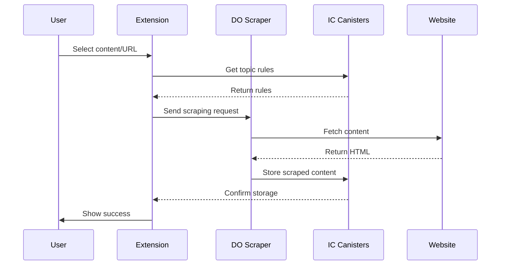

# RhinoSpider Scraping Architecture

## Overview

RhinoSpider implements a distributed web scraping system with a hybrid architecture combining Internet Computer (IC) canisters and a Digital Ocean (DO) intermediate service. This design solves several key challenges:
- Consensus issues in IC HTTP outcalls
- Reliable web scraping of modern websites
- Consistent data collection
- Scalable processing

## System Components

### 1. Admin Portal (IC Canister)
- Manages scraping topics and rules
- Defines extraction patterns
- Views and analyzes collected data
- Handles user permissions
- Monitors system health

### 2. Extension
- Chrome extension for user interaction
- Sends scraping requests to DO service
- Communicates with IC canisters for:
  - Topic rules
  - Data storage
  - User authentication

### 3. Digital Ocean Scraping Service
- Intermediate layer for reliable web scraping
- Features:
  - Uses Puppeteer for modern web compatibility
  - Handles rate limiting
  - Manages request queuing
  - Provides consistent responses
- Components:
  - Express.js server
  - Redis for queue management
  - Docker containers for isolation

### 4. Storage Canister (IC)
- Stores scraped content
- Manages data persistence
- Handles access control
- Provides data to admin portal

## Data Flow



## Implementation Details

### 1. Digital Ocean Setup
```bash
# Server Requirements
- Ubuntu 22.04 LTS
- Docker & Docker Compose
- Node.js 18+
- 1GB RAM minimum
- 25GB SSD

# Key Components
/opt/rhinospider-scraper/
├── docker-compose.yml    # Service orchestration
├── Dockerfile           # Node.js & Chrome setup
├── src/
│   └── index.js        # Main scraping service
└── package.json        # Dependencies
```

### 2. Security Considerations
- DO service only accepts requests from authenticated extensions
- All sensitive data stored in IC canisters
- DO service acts as stateless proxy
- Regular security updates for DO service

### 3. Error Handling
- Automatic retries for failed requests
- Queue-based processing
- Error reporting to IC canister
- Monitoring and alerts

### 4. Scaling
- Horizontal scaling via DO droplets
- Redis for queue management
- Load balancing if needed
- Resource monitoring

## Deployment

### 1. Digital Ocean Service
```bash
# Initial setup
ssh root@<droplet-ip>
cd /opt/rhinospider-scraper
docker compose up -d

# Monitoring
docker compose logs -f
curl http://localhost:3000/health
```

### 2. Extension Configuration
```typescript
// Update extension config to use DO service
const SCRAPER_SERVICE_URL = 'http://<droplet-ip>:3000';
```

### 3. IC Canister Updates
- Modified to receive data from DO service
- Enhanced error handling
- Improved data validation

## Maintenance

### 1. Regular Tasks
- Monitor DO service health
- Update dependencies
- Backup Redis data
- Review error logs

### 2. Performance Monitoring
- Track response times
- Monitor queue length
- Check resource usage
- Analyze error rates

### 3. Updates
- Regular security patches
- Dependency updates
- Feature enhancements
- Performance optimizations
