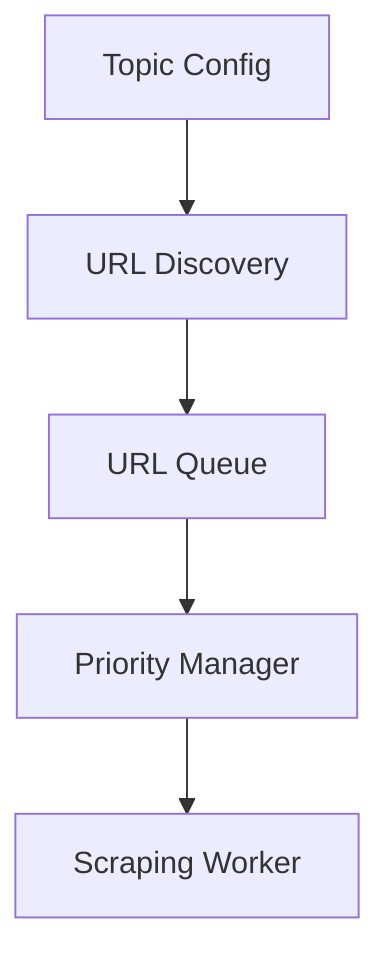
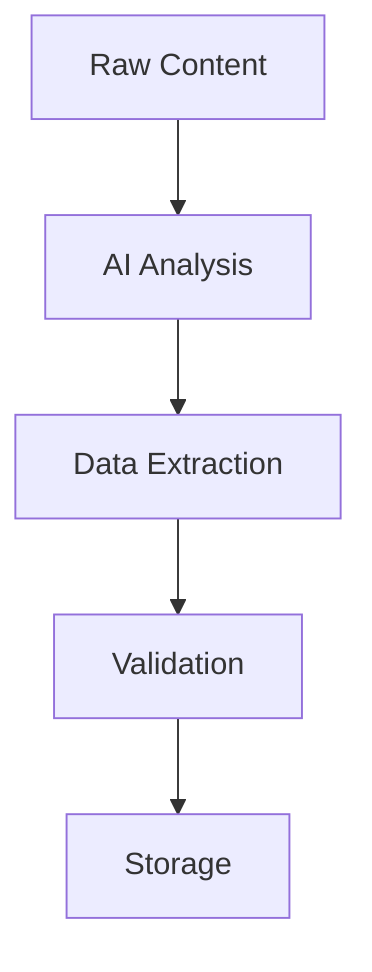

# RhinoSpider Scraping Architecture

## Overview

RhinoSpider implements a distributed web scraping system where users share their bandwidth to help collect data. The system is designed to be:
- Seamless and unobtrusive to users
- Bandwidth-conscious
- Privacy-respecting
- Scalable across many users

## System Components

### 1. Background Service Worker
The core of the scraping functionality runs in a Chrome Extension Service Worker (`background.js`), allowing it to operate even when the extension popup is closed.

```javascript
// Background operation lifecycle
chrome.runtime.onInstalled -> initDB() -> startScrapingScheduler()
```

### 2. Data Storage
- Uses Internet Computer canisters for decentralized storage
- Local IndexedDB for temporary storage and caching
- Efficient data structures for quick access and updates

### 3. Scraping Engine
- Distributed scraping across user base
- Rate limiting and bandwidth management
- Smart retry and error handling
- Proxy support for reliability

## Topic Management

### Current Focus: AI/ML Topic

#### Target Resources

1. **GitHub Repositories**
   - API Endpoint: `https://api.github.com/search/repositories`
   - Search Parameters:
     ```json
     {
       "q": "topic:artificial-intelligence topic:machine-learning",
       "sort": "updated",
       "per_page": 100
     }
     ```
   - Data to Extract:
     - Repository name
     - Description
     - Stars/Forks
     - Last update
     - Topics
     - README content

2. **Research Papers**
   - Sources: arXiv, Papers with Code
   - Data to Extract:
     - Title
     - Authors
     - Abstract
     - Publication date
     - Citations
     - Code links

### Topic Configuration
```typescript
interface Topic {
    id: string;
    name: string;
    description: string;
    sources: Source[];
    extractionRules: ExtractionRule[];
}
```

## Data Flow

### 1. Content Discovery


### 2. Content Processing


## Implementation Details

### 1. Rate Limiting
- Per-domain rate limits
- Global rate limiting
- User-specific quotas
- Adaptive rate adjustment

### 2. Error Handling
- Retry with exponential backoff
- Circuit breaker for failing domains
- Error logging and monitoring
- Graceful degradation

### 3. Data Validation
- Schema validation
- Content quality checks
- Duplicate detection
- Data normalization

## Local Development

### Testing
1. Use mock responses for external APIs
2. Test with sample HTML content
3. Validate extraction rules
4. Check rate limiting behavior

### Configuration
```javascript
{
  "development": {
    "mockResponses": true,
    "localStorage": true,
    "bypassRateLimits": true
  }
}
```

## Production Deployment

### Requirements
1. IC canister deployment
2. Cycles for HTTP outbound calls (1.6B per call)
3. Rate limit configuration
4. Monitoring setup

### Monitoring
- Success/failure rates
- Response times
- Data quality metrics
- Resource usage

## Future Improvements

1. **Content Discovery**
   - ML-based URL prioritization
   - Content similarity detection
   - Automated source discovery

2. **Performance**
   - Distributed processing
   - Caching optimization
   - Resource pooling

3. **Data Quality**
   - Enhanced validation
   - Cross-source verification
   - Automated quality scoring
