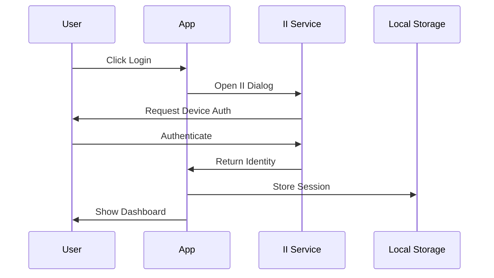

# Internet Identity Integration in RhinoSpider

## Overview

This document outlines the implementation of Internet Identity (II) authentication in RhinoSpider. Internet Identity is ICP's native authentication system that provides secure, anonymous authentication across dapps.

## Why Internet Identity?

1. **Security**
   - Cryptographically secure authentication
   - No password storage required
   - Device-based authentication
   - Protection against phishing

2. **User Privacy**
   - Anonymous authentication
   - Different identities for different dapps
   - No personal data collection

3. **Cross-platform Support**
   - Works across browsers
   - Mobile device support
   - Hardware security key support

## Implementation Steps

### 1. Initial Setup

#### 1.1 Dependencies
```json
{
  "dependencies": {
    "@dfinity/auth-client": "^0.15.0",
    "@dfinity/identity": "^0.15.0",
    "@dfinity/principal": "^0.15.0"
  }
}
```

#### 1.2 Environment Configuration
```env
II_URL=https://identity.ic0.app
CANISTER_ID_INTERNET_IDENTITY=rdmx6-jaaaa-aaaaa-aaadq-cai
```

### 2. Authentication Flow

#### 2.1 Core Authentication Service
```typescript
// services/auth.ts
import { AuthClient } from '@dfinity/auth-client';
import { Identity } from '@dfinity/identity';

export class AuthService {
  private authClient: AuthClient | null = null;
  
  async initialize(): Promise<void> {
    this.authClient = await AuthClient.create();
    await this.authClient.isAuthenticated();
  }
  
  async login(): Promise<Identity | undefined> {
    return new Promise((resolve) => {
      this.authClient?.login({
        identityProvider: process.env.II_URL,
        onSuccess: () => {
          resolve(this.authClient?.getIdentity());
        },
        onError: (error) => {
          console.error('Login failed:', error);
          resolve(undefined);
        }
      });
    });
  }
  
  async logout(): Promise<void> {
    await this.authClient?.logout();
  }
  
  getIdentity(): Identity | undefined {
    return this.authClient?.getIdentity();
  }
}
```

#### 2.2 User Profile Integration
```motoko
// canisters/user_profile/main.mo

actor UserProfile {
  type Profile = {
    principal: Principal;
    devices: [Text];
    created: Time.Time;
    lastLogin: Time.Time;
  };
  
  private stable var profiles : [(Principal, Profile)] = [];
  private var profileMap = HashMap.HashMap<Principal, Profile>(0, Principal.equal, Principal.hash);
  
  public shared({ caller }) func createProfile() : async Result.Result<Profile, Text> {
    if (Principal.isAnonymous(caller)) {
      return #err("Anonymous principal not allowed");
    };
    
    let profile : Profile = {
      principal = caller;
      devices = [];
      created = Time.now();
      lastLogin = Time.now();
    };
    
    profileMap.put(caller, profile);
    #ok(profile)
  };
  
  public shared({ caller }) func getProfile() : async Result.Result<Profile, Text> {
    switch (profileMap.get(caller)) {
      case (?profile) { #ok(profile) };
      case null { #err("Profile not found") };
    };
  };
}
```

### 3. Extension Integration

#### 3.1 Authentication Context
```typescript
// context/AuthContext.tsx
import React, { createContext, useContext, useState, useEffect } from 'react';
import { AuthService } from '../services/auth';
import type { Identity } from '@dfinity/identity';

interface AuthContextType {
  identity: Identity | undefined;
  isAuthenticated: boolean;
  login: () => Promise<void>;
  logout: () => Promise<void>;
}

const AuthContext = createContext<AuthContextType | undefined>(undefined);
const authService = new AuthService();

export function AuthProvider({ children }: { children: React.ReactNode }) {
  const [identity, setIdentity] = useState<Identity>();
  const [isAuthenticated, setIsAuthenticated] = useState(false);
  
  useEffect(() => {
    authService.initialize().then(() => {
      const identity = authService.getIdentity();
      setIdentity(identity);
      setIsAuthenticated(!!identity);
    });
  }, []);
  
  const login = async () => {
    const identity = await authService.login();
    setIdentity(identity);
    setIsAuthenticated(!!identity);
  };
  
  const logout = async () => {
    await authService.logout();
    setIdentity(undefined);
    setIsAuthenticated(false);
  };
  
  return (
    <AuthContext.Provider value={{ identity, isAuthenticated, login, logout }}>
      {children}
    </AuthContext.Provider>
  );
}
```

#### 3.2 Protected Routes
```typescript
// components/ProtectedRoute.tsx
import { useAuth } from '../hooks/useAuth';
import { Navigate } from 'react-router-dom';

export function ProtectedRoute({ children }: { children: React.ReactNode }) {
  const { isAuthenticated } = useAuth();
  
  if (!isAuthenticated) {
    return <Navigate to="/login" replace />;
  }
  
  return children;
}
```

### 4. Security Considerations

1. **Principal Validation**
   - Always validate caller principal
   - Never trust anonymous principals
   - Implement proper access control

2. **Session Management**
   - Implement session timeouts
   - Handle device linking securely
   - Clear sessions on logout

3. **Error Handling**
   - Graceful authentication failure
   - Clear error messages
   - Retry mechanisms

### 5. Testing Strategy

#### 5.1 Unit Tests
```typescript
describe('AuthService', () => {
  let authService: AuthService;
  
  beforeEach(() => {
    authService = new AuthService();
  });
  
  it('should initialize successfully', async () => {
    await expect(authService.initialize()).resolves.not.toThrow();
  });
  
  it('should handle login success', async () => {
    const identity = await authService.login();
    expect(identity).toBeDefined();
  });
  
  it('should handle logout', async () => {
    await authService.logout();
    expect(authService.getIdentity()).toBeUndefined();
  });
});
```

#### 5.2 Integration Tests
```typescript
describe('UserProfile', () => {
  let userProfile: UserProfile;
  
  beforeEach(async () => {
    userProfile = await UserProfile.create();
  });
  
  it('should create profile for authenticated user', async () => {
    const result = await userProfile.createProfile();
    expect(result.ok).toBeDefined();
  });
  
  it('should reject anonymous principals', async () => {
    // Test with anonymous principal
    const result = await userProfile.createProfile();
    expect(result.err).toBe("Anonymous principal not allowed");
  });
});
```

### 6. Deployment Steps

1. **Local Development**
   ```bash
   # Start local II replica
   dfx start --clean
   dfx deploy internet_identity
   dfx deploy user_profile
   ```

2. **Production Deployment**
   ```bash
   # Deploy to IC mainnet
   dfx deploy --network ic
   ```

### 7. Future Enhancements

1. **Advanced Features**
   - Multi-device support
   - Device management UI
   - Session recovery
   - Hardware key support

2. **Security Improvements**
   - Rate limiting
   - Suspicious activity detection
   - Enhanced logging

3. **User Experience**
   - Streamlined login flow
   - Better error handling
   - Progressive authentication

## Resources

1. Official Documentation
   - [Internet Identity Specification](https://internetcomputer.org/docs/current/references/ii-spec/)
   - [Authentication Guide](https://internetcomputer.org/docs/current/developer-docs/build/frontend/auth/)
   - [Identity Integration](https://internetcomputer.org/docs/current/developer-docs/build/frontend/auth/auth-how-to/)

2. Security Best Practices
   - [IC Security Best Practices](https://internetcomputer.org/docs/current/developer-docs/security/rust-canister-development-security-best-practices/)
   - [Authentication Security](https://internetcomputer.org/docs/current/developer-docs/security/rust-canister-development-security-best-practices/#authentication)

3. Example Implementations
   - [II Integration Examples](https://github.com/dfinity/examples/tree/master/motoko/internet-identity)
   - [Auth Client Demo](https://github.com/dfinity/auth-client)
# Internet Identity (ICP) Integration

## Overview
RhinoSpider uses Internet Computer Protocol's (ICP) Internet Identity service for secure, decentralized authentication. This service provides cryptographic identity management without traditional username/password combinations.

## Features

### 1. Authentication
- Cryptographic public/private key pairs
- No password storage required
- Device-based authentication
- Secure session management
- Automatic timeout handling

### 2. Security
- Zero sensitive data storage
- Cryptographic principals for identity
- Secure key management
- Session encryption
- Automatic cleanup

### 3. User Experience
- One-click authentication
- No password to remember
- Cross-device support
- Seamless session management
- Clear error handling

## Technical Implementation

### 1. Dependencies
```json
{
  "@dfinity/agent": "^0.15.0",
  "@dfinity/auth-client": "^0.15.0",
  "@dfinity/identity": "^0.15.0",
  "@dfinity/principal": "^0.15.0"
}
```

### 2. Configuration
```typescript
// Environment Variables
VITE_II_URL=https://identity.ic0.app  // Production II endpoint

// AuthProvider Configuration
<AuthProvider
  config={{
    appName: "RhinoSpider",
    logo: "/icons/icon128.png",
    iiUrl: import.meta.env.VITE_II_URL,
    storage: {
      type: 'localStorage',
      key: 'rhinospider_auth'
    },
    persistLogin: true,
    onSignup: async (identity) => {
      // Handle first-time users
    },
    onLogin: async (identity) => {
      // Handle returning users
    },
    onLogout: async () => {
      // Cleanup on logout
    }
  }}
>
```

### 3. Usage in Components
```typescript
import { useAuthContext } from '@rhinospider/web3-client';

function MyComponent() {
  const { 
    identity,    // Current user identity
    login,      // Login function
    logout,     // Logout function
    isLoading   // Auth state loading indicator
  } = useAuthContext();

  // Get user's principal (unique identifier)
  const principal = identity?.getPrincipal();
}
```

## Authentication Flow

### 1. Login Process


### 2. Session Management
- 30-minute idle timeout
- Automatic session renewal
- Secure storage in localStorage
- Cleanup on logout/timeout

### 3. Error Handling
```typescript
try {
  await login();
} catch (error) {
  // Handle specific error types
  if (error instanceof AuthError) {
    // Auth-specific error handling
  } else {
    // Generic error handling
  }
}
```

## Security Considerations

### 1. Data Storage
- No sensitive credentials stored
- Only encrypted session data
- Automatic cleanup
- Secure key management

### 2. Session Security
- Short-lived sessions
- Cryptographic session tokens
- Secure renewal process
- Automatic timeout

### 3. Best Practices
- Regular security audits
- Clear error messages
- Secure error logging
- Rate limiting

## Development Setup

### 1. Installation
```bash
# Install dependencies
pnpm add @dfinity/agent @dfinity/auth-client @dfinity/identity @dfinity/principal

# Set up environment
echo "VITE_II_URL=https://identity.ic0.app" > .env
```

### 2. Local Development
```bash
# Start local II replica (optional)
dfx start --clean --background
dfx deploy internet_identity

# Update environment for local development
echo "VITE_II_URL=http://localhost:4943?canisterId=[local-ii-canister-id]" > .env.local
```

## Testing

### 1. Unit Tests
```typescript
describe('Authentication', () => {
  it('should handle login success', async () => {
    // Test login flow
  });

  it('should handle login failure', async () => {
    // Test error cases
  });
});
```

### 2. E2E Tests
```typescript
describe('E2E Auth Flow', () => {
  it('should complete full auth cycle', async () => {
    // Test full auth flow
  });
});
```

## Troubleshooting

### Common Issues
1. **Session Timeout**
   - Check idle timeout settings
   - Verify session storage
   - Check network connectivity

2. **Authentication Failures**
   - Verify II service status
   - Check network connectivity
   - Validate configuration

3. **Device Issues**
   - Verify device compatibility
   - Check browser support
   - Validate security settings

## Future Enhancements

### 1. Additional Features
- Multi-factor authentication
- Hardware key support
- Biometric authentication
- Recovery mechanisms

### 2. Integration Options
- NFID support
- Plug Wallet integration
- Cross-chain authentication
- Social login options

### 3. User Management
- Profile management
- Role-based access
- Team accounts
- Access control lists

## Resources

### Official Documentation
- [Internet Identity Specification](https://internetcomputer.org/docs/current/references/ii-spec/)
- [ICP Developer Docs](https://internetcomputer.org/docs/current/developer-docs/)
- [DFINITY SDK Reference](https://sdk.dfinity.org/docs/)
