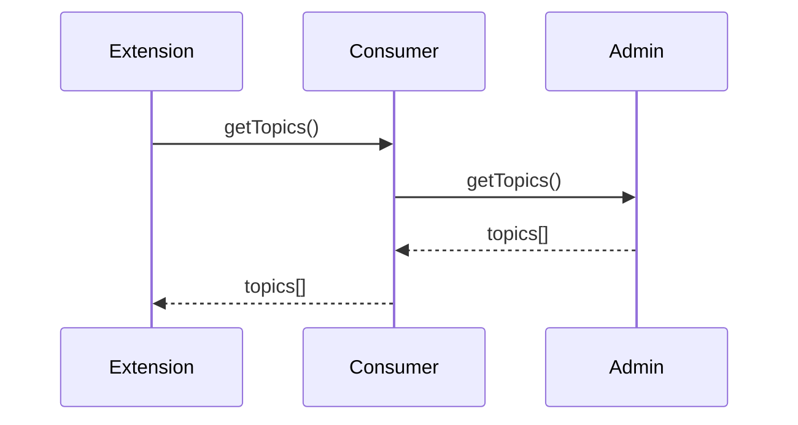
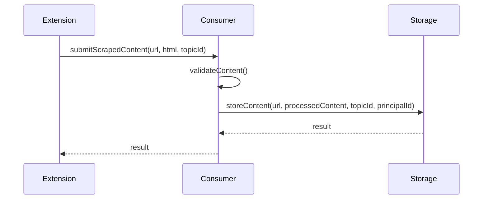
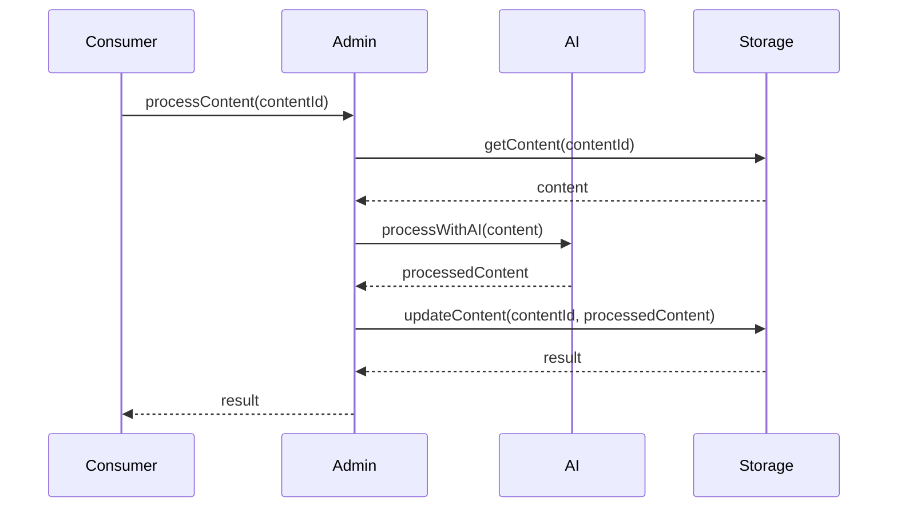

# User Flows

## Topic Fetching Flow

```mermaid
sequenceDiagram
    participant Extension
    participant Consumer
    participant Admin
    
    Extension->>Consumer: getTopics()
    Consumer->>Admin: getTopics()
    Admin-->>Consumer: topics[]
    Consumer-->>Extension: topics[]
```

## Content Submission Flow

```mermaid
sequenceDiagram
    participant Extension
    participant Consumer
    participant Storage
    
    Extension->>Consumer: submitScrapedContent(url, html, topicId)
    Consumer->>Consumer: validateContent()
    Consumer->>Storage: storeContent(url, processedContent, topicId, principalId)
    Storage-->>Consumer: result
    Consumer-->>Extension: result
```

## AI Processing Flow

```mermaid
sequenceDiagram
    participant Consumer
    participant Admin
    participant AI
    participant Storage
    
    Consumer->>Admin: processContent(contentId)
    Admin->>Storage: getContent(contentId)
    Storage-->>Admin: content
    Admin->>AI: processWithAI(content)
    AI-->>Admin: processedContent
    Admin->>Storage: updateContent(contentId, processedContent)
    Storage-->>Admin: result
    Admin-->>Consumer: result
```
