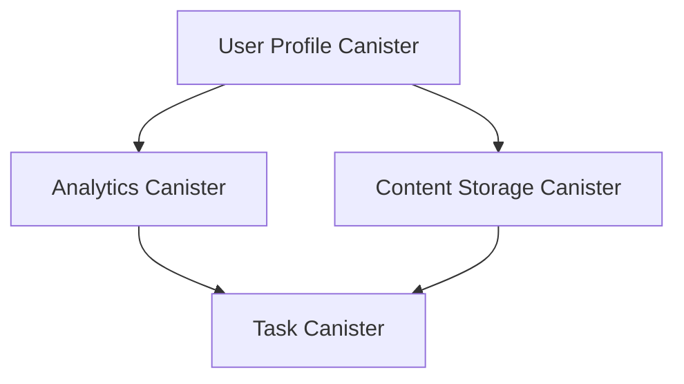

# Canister Data Collection and Integration Guide

## Overview
This document explains how RhinoSpider implements data collection and storage using ICP canisters, detailing the architecture, implementation, and best practices.

## Canister Architecture

### 1. Core Canisters



#### 1.1 User Profile Canister
Stores user data and manages authentication state
```motoko
type UserProfile = {
    principal: Principal;
    created: Time.Time;
    lastActive: Time.Time;
    deviceIds: [Text];
    metrics: UserMetrics;
};
```

#### 1.2 Analytics Canister
Handles metrics and performance data
```motoko
type Metric = {
    id: Text;
    type_: MetricType;
    value: Int;
    timestamp: Time.Time;
    metadata: ?Text;
};
```

#### 1.3 Content Storage Canister
Manages scraped content and metadata
```motoko
type Content = {
    id: Text;
    url: Text;
    data: Blob;
    timestamp: Time.Time;
    metrics: ContentMetrics;
};
```

## Implementation Details

### 1. Data Storage Patterns

#### 1.1 Stable Storage
```motoko
actor ContentStorage {
    private stable var contents : [(Text, Content)] = [];
    private var contentMap = HashMap.HashMap<Text, Content>(0, Text.equal, Text.hash);

    system func preupgrade() {
        contents := Iter.toArray(contentMap.entries());
    };

    system func postupgrade() {
        contentMap := HashMap.fromIter<Text, Content>(
            contents.vals(), 
            contents.size(), 
            Text.equal, 
            Text.hash
        );
        contents := [];
    };
}
```

#### 1.2 Memory Management
```motoko
// Implement chunking for large data
private func storeInChunks(data: Blob) : async [Text] {
    let chunkSize = 1024 * 1024; // 1MB chunks
    var chunks : [Text] = [];
    
    for (i in Iter.range(0, data.size() / chunkSize)) {
        let chunk = Blob.slice(data, i * chunkSize, Min.min(data.size(), (i + 1) * chunkSize));
        let chunkId = await storeChunk(chunk);
        chunks := Array.append(chunks, [chunkId]);
    };
    
    chunks
}
```

### 2. Data Collection Methods

#### 2.1 Direct Collection
```motoko
public shared({ caller }) func recordMetric(metric: Metric) : async () {
    assert(isAuthorized(caller));
    
    let timestamp = Time.now();
    let metricWithTimestamp = {
        metric with
        timestamp = timestamp;
    };
    
    metrics.put(metric.id, metricWithTimestamp);
    await aggregateMetrics();
}
```

#### 2.2 Batch Processing
```motoko
public shared({ caller }) func batchRecordMetrics(metrics: [Metric]) : async () {
    assert(isAuthorized(caller));
    
    let timestamp = Time.now();
    for (metric in metrics.vals()) {
        let metricWithTimestamp = {
            metric with
            timestamp = timestamp;
        };
        metrics.put(metric.id, metricWithTimestamp);
    };
    
    await aggregateMetrics();
}
```

### 3. Inter-Canister Communication

#### 3.1 Async Calls
```motoko
public shared({ caller }) func updateUserMetrics(userId: Principal, metric: Metric) : async () {
    // Update analytics
    await analyticsCanister.recordMetric(metric);
    
    // Update user profile
    await userProfileCanister.updateMetrics(userId, metric);
}
```

#### 3.2 Error Handling
```motoko
public shared({ caller }) func safeUpdateMetrics(metric: Metric) : async Result.Result<(), Text> {
    try {
        await analyticsCanister.recordMetric(metric);
        #ok(());
    } catch (error) {
        #err("Failed to update metrics: " # Error.message(error));
    }
}
```

## Best Practices

### 1. Data Validation
```motoko
private func validateMetric(metric: Metric) : Bool {
    switch (metric.type_) {
        case (#Scraping) validateScrapingMetric(metric);
        case (#UserEngagement) validateEngagementMetric(metric);
        case (#SystemPerformance) validatePerformanceMetric(metric);
        case _ false;
    }
}
```

### 2. Rate Limiting
```motoko
private let MAX_REQUESTS_PER_MINUTE = 60;
private var requestCounts = HashMap.HashMap<Principal, Nat>(0, Principal.equal, Principal.hash);

private func checkRateLimit(caller: Principal) : Bool {
    switch (requestCounts.get(caller)) {
        case (?count) {
            if (count >= MAX_REQUESTS_PER_MINUTE) {
                return false;
            };
            requestCounts.put(caller, count + 1);
        };
        case null {
            requestCounts.put(caller, 1);
        };
    };
    true
}
```

### 3. Data Retention
```motoko
private func cleanupOldData() : async () {
    let cutoffTime = Time.now() - (30 * 24 * 60 * 60 * 1_000_000_000); // 30 days
    
    for ((id, metric) in metrics.entries()) {
        if (metric.timestamp < cutoffTime) {
            metrics.delete(id);
        };
    };
}
```

## Performance Optimization

### 1. Indexing
```motoko
private var timeIndex = HashMap.HashMap<Int, [Text]>(0, Int.equal, Int.hash);

private func indexMetricByTime(metric: Metric) {
    let dayTimestamp = metric.timestamp / (24 * 60 * 60 * 1_000_000_000);
    switch (timeIndex.get(dayTimestamp)) {
        case (?ids) {
            timeIndex.put(dayTimestamp, Array.append(ids, [metric.id]));
        };
        case null {
            timeIndex.put(dayTimestamp, [metric.id]);
        };
    };
}
```

### 2. Caching
```motoko
private var metricCache = HashMap.HashMap<Text, (Metric, Time.Time)>(0, Text.equal, Text.hash);

private func getCachedMetric(id: Text) : ?Metric {
    switch (metricCache.get(id)) {
        case (?(metric, timestamp)) {
            if (Time.now() - timestamp < 5 * 60 * 1_000_000_000) { // 5 minutes
                ?metric
            } else {
                metricCache.delete(id);
                null
            };
        };
        case null null;
    };
}
```

## Monitoring and Debugging

### 1. Logging
```motoko
private func logError(error: Text) : async () {
    await analyticsCanister.recordSystemMetric({
        type_ = #Error;
        message = error;
        timestamp = Time.now();
    });
}
```

### 2. Health Checks
```motoko
public query func getHealth() : async {
    uptime: Int;
    memoryUsage: Nat;
    metrics: Nat;
} {
    {
        uptime = Time.now() - startTime;
        memoryUsage = Prim.rts_memory_size();
        metrics = metrics.size();
    }
}
```

## Resources and References

1. Official Documentation:
   - [Motoko Programming Language](https://internetcomputer.org/docs/current/developer-docs/build/cdks/motoko-dfinity/motoko/)
   - [Canister Development Guide](https://internetcomputer.org/docs/current/developer-docs/build/cdks/)
   - [Data Storage Best Practices](https://internetcomputer.org/docs/current/developer-docs/build/cdks/motoko-dfinity/stable-variables/)

2. Tools Used:
   - [DFX CLI](https://internetcomputer.org/docs/current/references/dfx-json-reference/)
   - [Motoko Playground](https://m7sm4-2iaaa-aaaab-qabra-cai.raw.ic0.app/)
   - [Candid Interface Description Language](https://internetcomputer.org/docs/current/developer-docs/build/candid/candid-intro)

3. Community Resources:
   - [DFINITY Forum](https://forum.dfinity.org/)
   - [GitHub Examples](https://github.com/dfinity/examples)
   - [Motoko Base Library](https://internetcomputer.org/docs/current/developer-docs/build/cdks/motoko-dfinity/base/)
