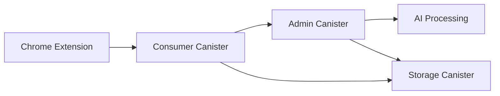

# RhinoSpider Architecture

## Overview

RhinoSpider is a distributed web scraping system that operates through a Chrome extension. The system uses Internet Identity (II) for authentication and Internet Computer Protocol (ICP) canisters for data storage and management.

## Core Architecture

## Key Principles

1. **Strict Access Control**
   - Extension NEVER directly accesses admin or storage canisters
   - All data flows through consumer canister
   - Extension operates in read-only mode for admin data
   - Extension submits scraped content through consumer canister only

2. **Authentication Requirements**
   - All requests must be properly authenticated with Internet Identity
   - Delegation chain must be maintained and validated
   - Consumer canister validates all authentication before forwarding

3. **Data Validation**
   - Consumer canister validates all data before forwarding
   - Each canister implements its own validation
   - Errors are handled at each level

## Task Routing Layer

A "router layer" provides granular control over task assignment. This allows administrators to define specific parameters for tasks, ensuring that only a relevant subset of available nodes picks up and executes a given task.

- **Task Definition with Parameters**: Geolocation, Percentage of Nodes, Randomization Mode.
- **On-Chain Routing Logic**: The Admin Canister evaluates the node's characteristics against the task's defined parameters.
- **Task Execution and Data Storage**: Assigned nodes execute tasks and push data to the Storage Canister.
