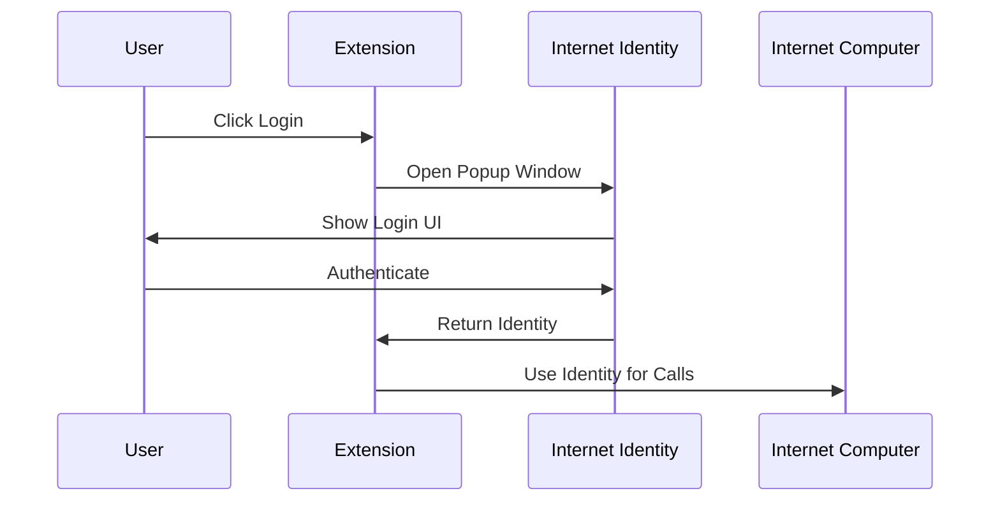

# RhinoSpider Authentication

## Overview

RhinoSpider uses Internet Identity (II) as its primary authentication system. II is ICP's native authentication system that provides secure, anonymous authentication across dapps.

## Authentication Flow

## Extension Implementation

The extension uses a delegation chain pattern for secure cross-context identity management.

- **Delegation Chain Storage**: The delegation chain is stored in the extension's local storage.
- **Identity Reconstruction**: The identity is reconstructed from the stored delegation chain for each request.
- **Base Identity**: A temporary `Ed25519KeyIdentity` is generated as a base identity to provide the necessary signing implementation.

## Security Considerations

- **Storage Security**: Binary data is stored as arrays, and expiration is stored as a hex string. No private keys are ever stored.
- **Identity Handling**: A fresh base identity is generated for each session. The II delegation chain provides the actual security.
- **Delegation Chain Validation**: Expiration times are checked, target restrictions are enforced, and signatures are verified at each step.
