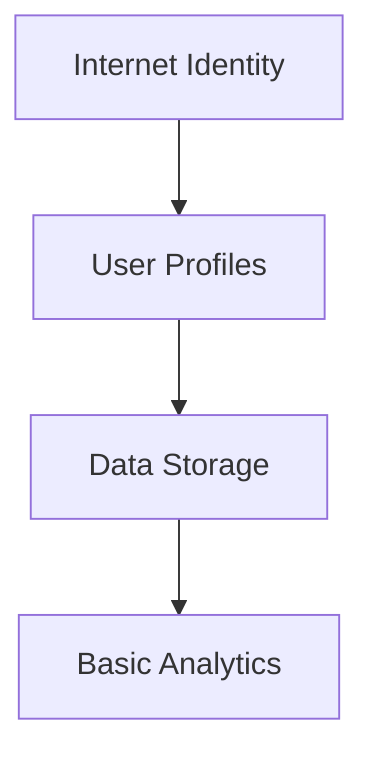
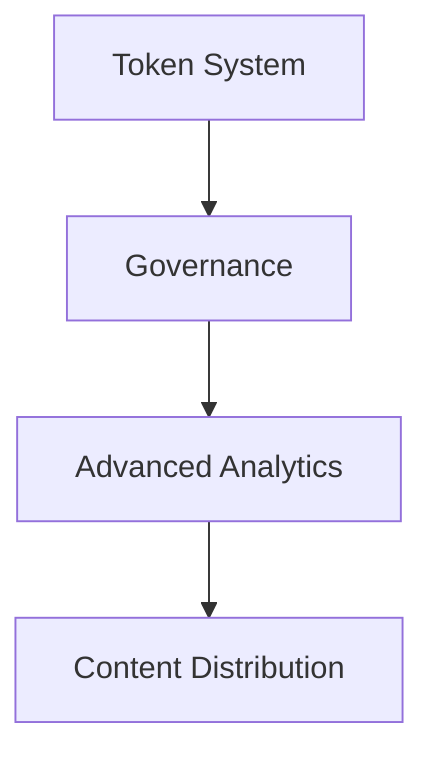

# RhinoSpider Feature Implementation Phases

## Overview
This document outlines the phased implementation approach for RhinoSpider's ICP features, prioritizing core functionality while planning for future enhancements.

## Phase 1: Core Features (Current Implementation)

### 1. Cross-platform Identity Management
**Status**: Ready for Implementation
**Priority**: High
**Complexity**: Medium

#### Implementation Details:
- Internet Identity integration
- Device linking system
- Session management
- Cross-platform authentication sync

#### Why First:
- Foundation for user tracking
- Essential for reward system
- Required for extension-desktop sync
- Basic security requirement

#### Integration Steps:
1. Set up Internet Identity authentication
2. Implement device linking system
3. Create session management
4. Add cross-platform sync

### 2. Basic Data Storage
**Status**: Ready for Implementation
**Priority**: High
**Complexity**: Low

#### Implementation Details:
- User profile storage
- Content metadata storage
- Basic analytics tracking
- Stable variable management

#### Why Now:
- Required for basic functionality
- Foundation for analytics
- Enables user tracking
- Simple to implement

#### Integration Steps:
1. Create user profile canister
2. Implement content storage
3. Set up basic analytics
4. Add data validation

## Phase 2: Near-Term Features (Next 2-3 Months)

### 3. Token-based Incentive System
**Status**: Planning
**Priority**: Medium
**Complexity**: High

#### Implementation Details:
- ICRC-1 token creation
- Basic reward distribution
- Wallet integration
- Transaction tracking

#### Why Later:
- Requires stable core features
- Needs economic modeling
- Complex security requirements
- Requires thorough testing

#### Future Integration Steps:
1. Create ICRC-1 token
2. Implement reward logic
3. Add wallet features
4. Set up transaction system

## Phase 3: Future Features (3-6 Months)

### 4. Community Governance
**Status**: Planning
**Priority**: Low
**Complexity**: High

#### Implementation Details:
- SNS DAO setup
- Voting mechanisms
- Proposal system
- Treasury management

### 5. Privacy-preserving Analytics
**Status**: Planning
**Priority**: Medium
**Complexity**: High

#### Implementation Details:
- Zero-knowledge proofs
- Data anonymization
- Secure aggregation
- Privacy-preserving metrics

### 6. Decentralized Content Sharing
**Status**: Planning
**Priority**: Medium
**Complexity**: High

#### Implementation Details:
- P2P content distribution
- Content verification
- Distributed storage
- Reputation system

## Technical Dependencies

### Current Phase Dependencies:

### Future Phase Dependencies:

## Resource Requirements

### Phase 1 (Current):
- Internet Identity integration
- Basic canister setup
- Frontend development
- Testing infrastructure

### Phase 2:
- Token economics design
- Smart contract auditing
- Additional canister cycles
- Security testing

### Phase 3:
- DAO infrastructure
- Advanced cryptography
- Distributed systems
- Performance optimization

## Risk Assessment

### Current Phase Risks:
1. Authentication complexity
2. Data consistency
3. Cross-platform sync issues
4. Performance bottlenecks

### Future Phase Risks:
1. Token economic stability
2. Governance participation
3. Privacy concerns
4. Scalability challenges

## Success Metrics

### Phase 1:
- User registration success rate
- Cross-platform sync reliability
- Data storage performance
- Basic analytics accuracy

### Phase 2:
- Token distribution efficiency
- Reward system fairness
- Transaction throughput
- User satisfaction

### Phase 3:
- Governance participation
- Privacy compliance
- Content distribution speed
- System decentralization

## Grant Application Focus

### Current Implementation Highlights:
1. Internet Computer integration
2. Canister architecture
3. Cross-platform capabilities
4. Data management

### Future Potential:
1. Token economics
2. Community governance
3. Privacy innovations
4. Scalability solutions

## Development Timeline

### Phase 1 (Current: 1-2 months):
- Week 1-2: Internet Identity integration
- Week 3-4: Data storage implementation
- Week 5-6: Basic analytics
- Week 7-8: Testing and optimization

### Phase 2 (2-3 months):
- Month 1: Token system design
- Month 2: Reward mechanism
- Month 3: Security and testing

### Phase 3 (3-6 months):
- Months 1-2: Governance setup
- Months 3-4: Privacy features
- Months 5-6: Content distribution

## Conclusion

The phased approach allows us to:
1. Build a solid foundation
2. Validate core features
3. Gather user feedback
4. Optimize for scalability
5. Maintain security
6. Plan for future growth

Would you like to proceed with Phase 1 implementation or need more details on any specific aspect?
