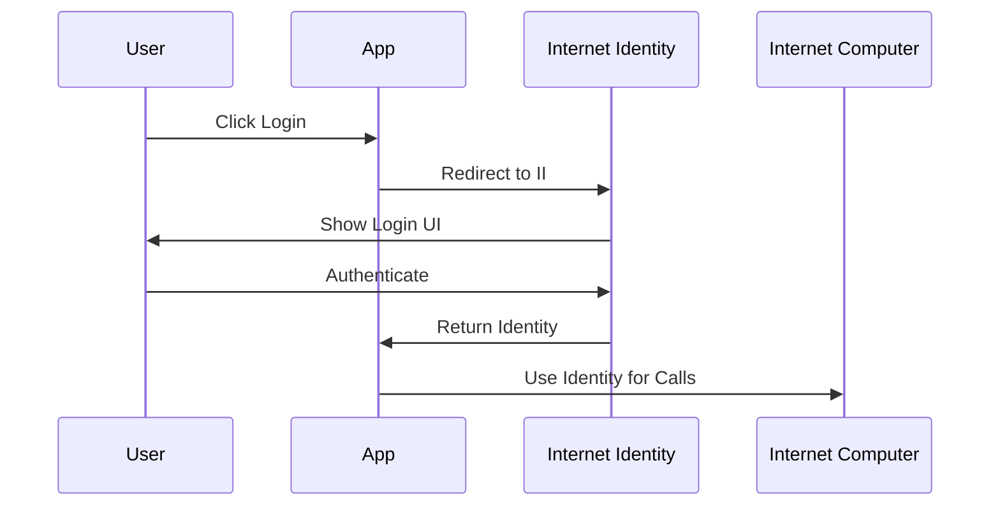

# RhinoSpider Authentication Guide

## Overview

RhinoSpider uses Internet Identity for secure authentication and cross-platform identity management. This document covers both the implementation details and usage guidelines.

## Current Implementation

### Development Mode
Currently using anonymous access for local development in two places:

1. `admin.ts`: Uses AnonymousIdentity for local development
2. `admin/main.mo`: Allows anonymous access in hasRole function

**Important**: This must be replaced with proper authentication before production deployment.

## Internet Identity Integration

### 1. Setup
```typescript
import { AuthClient } from "@dfinity/auth-client";
import { Identity } from "@dfinity/agent";

const authClient = await AuthClient.create();
```

### 2. Authentication Flow


### 3. Identity Management
```typescript
interface IdentityData {
    principal: Principal;
    devices: Device[];
    lastLogin: Timestamp;
}
```

## Cross-Platform Authentication

### 1. Device Linking
- QR code-based linking
- Secure key exchange
- Device verification

### 2. Session Management
- Session persistence
- Token refresh
- Secure logout

## Security Measures

### 1. Canister Signature Verification
```motoko
public shared(msg) func verifySignature(
    signature: Blob,
    message: Blob
) : async Bool {
    // Verification logic
}
```

### 2. Access Control
```motoko
public shared(msg) func hasRole(role: Text) : async Bool {
    let caller = msg.caller;
    // Role checking logic
}
```

## Local Development

### Testing Authentication
1. Start local Internet Identity replica:
   ```bash
   dfx deploy internet_identity --argument '(null)'
   ```

2. Configure local II canister:
   ```typescript
   const LOCAL_II_CANISTER = "rwlgt-iiaaa-aaaaa-aaaaa-cai";
   ```

### Anonymous Access
For development only:
```typescript
import { AnonymousIdentity } from "@dfinity/agent";
const devIdentity = new AnonymousIdentity();
```

## Production Migration

### Required Changes

1. **Remove Anonymous Access**
   - Remove AnonymousIdentity usage
   - Implement proper authentication checks
   - Update access control logic

2. **Internet Identity Integration**
   - Deploy with production II canister
   - Implement proper session management
   - Add error handling

3. **Security Hardening**
   - Fix canister signature verification
   - Implement rate limiting
   - Add audit logging

### Implementation Steps

1. Update `admin.ts`:
   ```typescript
   // Before deployment, replace:
   const identity = new AnonymousIdentity();
   
   // With:
   const identity = await authClient.getIdentity();
   ```

2. Update `admin/main.mo`:
   ```motoko
   // Remove anonymous access from hasRole
   public shared(msg) func hasRole(role: Text) : async Bool {
       let caller = msg.caller;
       switch (roles.get(caller)) {
           case (?userRoles) { userRoles.contains(role) };
           case null { false };
       }
   }
   ```

3. Add proper authentication checks:
   ```motoko
   public shared(msg) func authenticate() : async Result<Text> {
       let caller = msg.caller;
       if (Principal.isAnonymous(caller)) {
           #err("Authentication required");
       } else {
           #ok("Authenticated");
       }
   }
   ```

## Best Practices

1. **Security**
   - Never store sensitive data in clear text
   - Implement proper session timeouts
   - Use secure communication channels

2. **User Experience**
   - Clear error messages
   - Smooth authentication flow
   - Proper loading states

3. **Development**
   - Use environment-specific configurations
   - Implement proper testing
   - Document security requirements

## Testing

### Unit Tests
```typescript
describe('Authentication', () => {
    it('should reject anonymous access in production', async () => {
        // Test code
    });
});
```

### Integration Tests
```typescript
describe('Internet Identity', () => {
    it('should complete authentication flow', async () => {
        // Test code
    });
});
```

## Monitoring

### Security Events
- Failed authentication attempts
- Suspicious activity patterns
- Session anomalies

### Performance Metrics
- Authentication latency
- Success/failure rates
- Session statistics

## Future Improvements

1. **Enhanced Security**
   - Two-factor authentication
   - Hardware key support
   - Biometric authentication

2. **User Management**
   - Role-based access control
   - User groups
   - Delegation support

3. **Integration**
   - Single sign-on
   - OAuth support
   - External identity providers
