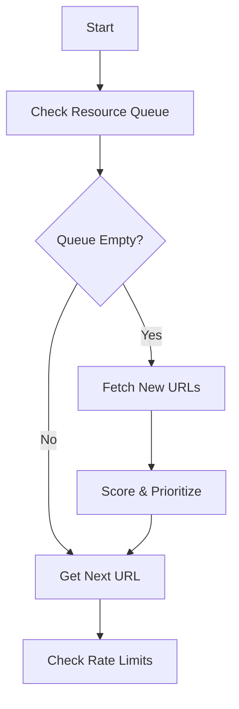
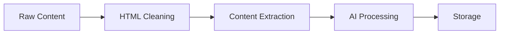

# RhinoSpider Scraping Plan

## MVP Focus: AI/ML Topic

For our MVP, we'll focus on the AI/ML topic, specifically targeting:

### Target Resources

1. **GitHub Repositories**
   - API Endpoint: `https://api.github.com/search/repositories`
   - Search Parameters:
     ```json
     {
       "q": "topic:artificial-intelligence topic:machine-learning",
       "sort": "updated",
       "per_page": 100
     }
     ```
   - Data to Extract:
     - Repository name
     - Description
     - README content
     - Star count
     - Last update
     - Main programming language
     - Topics/tags
     - License type

2. **Dev.to Articles**
   - API Endpoint: `https://dev.to/api/articles`
   - Search Parameters:
     ```json
     {
       "tag": "artificialintelligence",
       "top": 50,
       "state": "fresh"
     }
     ```
   - Data to Extract:
     - Title
     - Author
     - Publication date
     - Tags
     - Reading time
     - Reaction count
     - Full article content

3. **Medium Posts**
   - Access Method: RSS Feed + Article URLs
   - Feed URL: `https://medium.com/feed/tag/artificial-intelligence`
   - Data to Extract:
     - Title
     - Author
     - Publication date
     - Clap count
     - Reading time
     - Full article content
     - Related topics

## Scraping Logic

### 1. Content Discovery


### 2. Priority Scoring System
Each content piece is scored based on:

- **Freshness Score** (30%)
  ```python
  freshness = (current_time - publication_time) / max_age
  score = 1.0 - freshness  # Newer content scores higher
  ```

- **Engagement Score** (40%)
  ```python
  # GitHub: stars + forks
  # Dev.to: reactions + comments
  # Medium: claps + responses
  engagement = (metric_value / max_metric) * 100
  ```

- **Relevance Score** (30%)
  ```python
  # AI-based scoring using keywords and content analysis
  relevance = ai_model.analyze_relevance(content)
  ```

### 3. Rate Limiting

Per-site rate limits:
```json
{
  "github": {
    "requests_per_hour": 5000,
    "requests_per_minute": 30
  },
  "dev.to": {
    "requests_per_hour": 3000,
    "requests_per_minute": 20
  },
  "medium": {
    "requests_per_hour": 4000,
    "requests_per_minute": 25
  }
}
```

### 4. Data Processing Pipeline



1. **HTML Cleaning**
   - Remove ads
   - Strip scripts
   - Extract main content

2. **Content Extraction**
   - Title normalization
   - Author information
   - Publication date standardization
   - Tag/topic extraction

3. **AI Processing**
   - Topic classification
   - Content summarization
   - Key points extraction
   - Code snippet detection
   - Technology stack identification

4. **Storage**
   - Metadata in canister
   - Full content in chunks
   - Index generation

## Data Schema

```typescript
interface ScrapedContent {
    id: string;
    source: "github" | "devto" | "medium";
    url: string;
    title: string;
    author: string;
    publishDate: number;
    updateDate: number;
    content: string;
    summary: string;
    topics: string[];
    engagement: {
        stars?: number;
        reactions?: number;
        claps?: number;
        comments: number;
    };
    metadata: {
        readingTime?: number;
        language?: string;
        license?: string;
        techStack?: string[];
    };
    aiAnalysis: {
        relevanceScore: number;
        keyPoints: string[];
        codeSnippets: {
            language: string;
            code: string;
        }[];
    };
}
```

## MVP Implementation Steps

1. **Initial Setup**
   ```bash
   # Configure admin canister with AI topic
   dfx canister call admin updateConfig '(record {
     topics = vec { "artificial-intelligence" };
     targetSites = vec { 
       "github.com",
       "dev.to",
       "medium.com"
     };
     scanInterval = 1_800_000;
     maxBandwidthPerDay = 104_857_600;
   })'
   ```

2. **Test Data Collection**
   ```bash
   # Add initial tasks
   dfx canister call admin addTasks '(vec {
     record {
       id = "task1";
       url = "https://api.github.com/search/repositories";
       topic = "artificial-intelligence";
       priority = 1;
       createdAt = 1234567890;
       assignedTo = null;
       status = "pending";
     }
   })'
   ```

3. **View Results**
   ```bash
   # Get stored data
   dfx canister call storage getData '(record {
     topic = "artificial-intelligence";
     limit = 10;
   })'
   ```

## Monitoring and Analytics

Track the following metrics:
- Content processed per hour
- Success/failure rates
- Content quality scores
- Resource usage
- Rate limit status
- Unique content discovered

## Next Phase Improvements

1. **Content Discovery**
   - Add more sources (arXiv, research papers)
   - Implement cross-reference discovery
   - Add social media monitoring

2. **AI Processing**
   - Implement sentiment analysis
   - Add trend detection
   - Enable content relationship mapping

3. **Data Quality**
   - Add duplicate detection
   - Implement content verification
   - Add source credibility scoring
