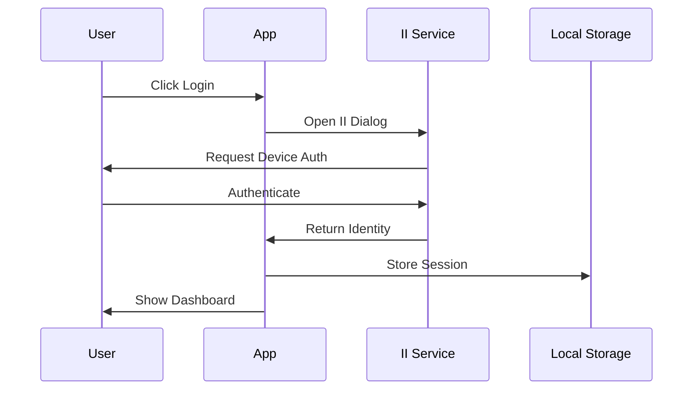

# Internet Identity (ICP) Integration

## Overview
RhinoSpider uses Internet Computer Protocol's (ICP) Internet Identity service for secure, decentralized authentication. This service provides cryptographic identity management without traditional username/password combinations.

## Features

### 1. Authentication
- Cryptographic public/private key pairs
- No password storage required
- Device-based authentication
- Secure session management
- Automatic timeout handling

### 2. Security
- Zero sensitive data storage
- Cryptographic principals for identity
- Secure key management
- Session encryption
- Automatic cleanup

### 3. User Experience
- One-click authentication
- No password to remember
- Cross-device support
- Seamless session management
- Clear error handling

## Technical Implementation

### 1. Dependencies
```json
{
  "@dfinity/agent": "^0.15.0",
  "@dfinity/auth-client": "^0.15.0",
  "@dfinity/identity": "^0.15.0",
  "@dfinity/principal": "^0.15.0"
}
```

### 2. Configuration
```typescript
// Environment Variables
VITE_II_URL=https://identity.ic0.app  // Production II endpoint

// AuthProvider Configuration
<AuthProvider
  config={{
    appName: "RhinoSpider",
    logo: "/icons/icon128.png",
    iiUrl: import.meta.env.VITE_II_URL,
    storage: {
      type: 'localStorage',
      key: 'rhinospider_auth'
    },
    persistLogin: true,
    onSignup: async (identity) => {
      // Handle first-time users
    },
    onLogin: async (identity) => {
      // Handle returning users
    },
    onLogout: async () => {
      // Cleanup on logout
    }
  }}
>
```

### 3. Usage in Components
```typescript
import { useAuthContext } from '@rhinospider/web3-client';

function MyComponent() {
  const { 
    identity,    // Current user identity
    login,      // Login function
    logout,     // Logout function
    isLoading   // Auth state loading indicator
  } = useAuthContext();

  // Get user's principal (unique identifier)
  const principal = identity?.getPrincipal();
}
```

## Authentication Flow

### 1. Login Process


### 2. Session Management
- 30-minute idle timeout
- Automatic session renewal
- Secure storage in localStorage
- Cleanup on logout/timeout

### 3. Error Handling
```typescript
try {
  await login();
} catch (error) {
  // Handle specific error types
  if (error instanceof AuthError) {
    // Auth-specific error handling
  } else {
    // Generic error handling
  }
}
```

## Security Considerations

### 1. Data Storage
- No sensitive credentials stored
- Only encrypted session data
- Automatic cleanup
- Secure key management

### 2. Session Security
- Short-lived sessions
- Cryptographic session tokens
- Secure renewal process
- Automatic timeout

### 3. Best Practices
- Regular security audits
- Clear error messages
- Secure error logging
- Rate limiting

## Development Setup

### 1. Installation
```bash
# Install dependencies
pnpm add @dfinity/agent @dfinity/auth-client @dfinity/identity @dfinity/principal

# Set up environment
echo "VITE_II_URL=https://identity.ic0.app" > .env
```

### 2. Local Development
```bash
# Start local II replica (optional)
dfx start --clean --background
dfx deploy internet_identity

# Update environment for local development
echo "VITE_II_URL=http://localhost:4943?canisterId=[local-ii-canister-id]" > .env.local
```

## Testing

### 1. Unit Tests
```typescript
describe('Authentication', () => {
  it('should handle login success', async () => {
    // Test login flow
  });

  it('should handle login failure', async () => {
    // Test error cases
  });
});
```

### 2. E2E Tests
```typescript
describe('E2E Auth Flow', () => {
  it('should complete full auth cycle', async () => {
    // Test full auth flow
  });
});
```

## Troubleshooting

### Common Issues
1. **Session Timeout**
   - Check idle timeout settings
   - Verify session storage
   - Check network connectivity

2. **Authentication Failures**
   - Verify II service status
   - Check network connectivity
   - Validate configuration

3. **Device Issues**
   - Verify device compatibility
   - Check browser support
   - Validate security settings

## Future Enhancements

### 1. Additional Features
- Multi-factor authentication
- Hardware key support
- Biometric authentication
- Recovery mechanisms

### 2. Integration Options
- NFID support
- Plug Wallet integration
- Cross-chain authentication
- Social login options

### 3. User Management
- Profile management
- Role-based access
- Team accounts
- Access control lists

## Resources

### Official Documentation
- [Internet Identity Specification](https://internetcomputer.org/docs/current/references/ii-spec/)
- [ICP Developer Docs](https://internetcomputer.org/docs/current/developer-docs/)
- [DFINITY SDK Reference](https://sdk.dfinity.org/docs/)
